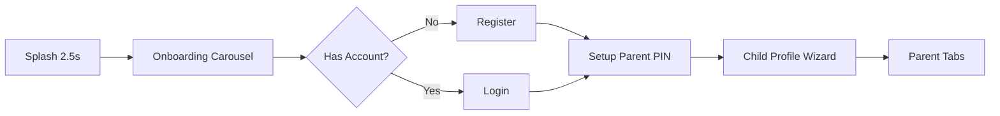
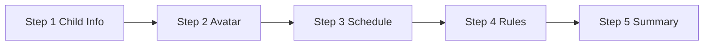

# KidsMind Mobile Client (Expo + React Native)


AI-powered, child-safe learning mobile app for ages 3–15 and parents.

- **Framework**: React Native 0.83 + TypeScript (strict)
- **Runtime**: Expo SDK 55 (New Architecture enabled)
- **Routing**: Expo Router v6 (file-based routing)
- **State**: Zustand v5 (auth) + TanStack Query v5 (server) + local `useState`
- **Validation**: Zod v4 (`zod/v4` import) + react-hook-form
- **Styling**: Custom design system via `constants/theme.ts`

---

## Quick Start

### Prerequisites

- Node.js **18+**
- npm **9+**
- iOS: Xcode 15+ & Simulator (macOS only)
- Android: Android Studio + emulator or physical device with USB debugging
- Expo Go (optional, for sandbox testing)

### Run locally

```bash
cd Apps/mobile
npm install
npx expo start
```

Then press:

| Key | Target |
| --- | --- |
| `i` | iOS Simulator |
| `a` | Android Emulator |
| `w` | Web browser (limited support) |

### Environment

- Copy `.env.example` to `.env` and set:
  - `EXPO_PUBLIC_API_BASE_URL` — production API (used when `IS_PROD=true`)
  - `EXPO_PUBLIC_API_BASE_IP_URL` — local network IP (used when `IS_PROD=false`, for physical device testing)
  - `IS_PROD` — defaults to `false`; injected into Expo `extra` via `app.config.ts`

```bash
# .env.example
IS_PROD=false
EXPO_PUBLIC_API_BASE_URL=http://localhost:8000
EXPO_PUBLIC_API_BASE_IP_URL=http://192.123.1.1:8000
```

> **Physical device note**: When `IS_PROD=false`, the app hits `EXPO_PUBLIC_API_BASE_IP_URL` because `localhost` is not reachable from a phone. Set this to your machine's LAN IP.

### Auth + Tokens (mobile)

- Mobile auth uses **Bearer token** headers (`Authorization: Bearer <access_token>`).
- Refresh token is stored in `expo-secure-store` (key: `kidsmind.refresh_token`).
- On web fallback, `localStorage` + in-memory is used.
- `apiClient` auto-retries once on 401 by refreshing the token (deduplicated promise).
- No CSRF tokens — mobile is exempt from CSRF middleware.

## Routes

### Auth flow

| Route | Screen | Description |
| --- | --- | --- |
| `/splash` | SplashScreen | Brand screen → auto-redirect to `/onboarding` after 2.5 s |
| `/onboarding` | OnboardingScreen | 3-slide carousel → `/register` or `/login` |
| `/(auth)/login` | LoginScreen | Email + password (react-hook-form + zod) |
| `/(auth)/register` | RegisterScreen | Full registration + country picker |
| `/(auth)/setup-pin` | SetupPinScreen | Parent PIN configuration (required before profile) |
| `/(auth)/child-profile-wizard` | ChildProfileWizard | 5-step child profile creation |

### Parent tabs — `/(tabs)/`

| Route | Screen | Description |
| --- | --- | --- |
| `/(tabs)/index` | ParentOverviewScreen | Dashboard overview |
| `/(tabs)/chat` | ConversationHistoryScreen | Chat history browser |
| `/(tabs)/explore` | ChildProgressScreen | Progress tracking |
| `/(tabs)/profile` | ParentalControlsScreen | Safety rules & settings |

### Child tabs — `/(child-tabs)/`

| Route | Screen | Description |
| --- | --- | --- |
| `/(child-tabs)/index` | ChildHomeDashboard | Child home dashboard |
| `/(child-tabs)/chat` | AIChatScreen | Qubie AI chat |
| `/(child-tabs)/explore` | SubjectTopicBrowser | Subject & topic browser |
| `/(child-tabs)/profile` | ProfileScreen | Child profile view |
| `/(child-tabs)/badges` | BadgesScreen | Badge collection (hidden tab) |

### Other routes

| Route | Screen | Description |
| --- | --- | --- |
| `/child-home` | Redirect | → `/(child-tabs)` with optional `childId` param |
| `/badges` | BadgesScreen | Badge collection |
| `/settings` | ParentalControlsScreen | Parental controls |
| `/modal` | ModalScreen | Generic modal (`presentation: 'modal'`) |

### Auth guard behavior

- `app/(auth)/_layout.tsx` redirects away if the user is authenticated, PIN is configured, and a child profile exists.
- `app/(tabs)/_layout.tsx` redirects away if the user is unauthenticated or has no profile.
- `app/(child-tabs)/_layout.tsx` disables swipe-back gestures (`gestureEnabled: false`) to prevent children from navigating out of the child space. `useChildNavigationLock` intercepts the Android hardware back button.

---

## How It Works

### Rendering flow

1. `app/_layout.tsx` loads fonts (`PlusJakartaSans`, `Inter`), wraps the app with `QueryClientProvider` + `AuthProvider`.
2. Expo Router resolves the current route from the file system.
3. Layout files (`_layout.tsx`) compose tab bars, guards, and navigation structure.
4. Screen components compose reusable UI components + hooks.
5. Business logic is isolated in hooks, services, and Zustand stores.

### State strategy

- **Auth state** — Zustand (`store/authStore.ts`): `isLoading`, `isAuthenticated`, `accessToken`, `user`, `authError`. Exposed via `contexts/AuthContext.tsx`.
- **Server state** — TanStack Query v5 (`services/queryClient.ts`): retry: 1, `refetchOnWindowFocus: false`. Mutations for login/register/logout.
- **Child state** — managed inside `AuthContext`: `childProfiles`, `selectedChildId`, `childProfileStatus`, subjects, topics, avatars.
- **Local UI state** — `useState` inside components/screens.
- **Session bootstrap** — `useSilentRefresh` hydrates an existing session on mount using the stored refresh token (15 s timeout).

### Navigation behavior

- Parent tabs use `BottomNavContainer` with 4 tabs.
- Child tabs use `ChildBottomNavContainer` with all four tabs always available.
- `useChildNavigationLock` prevents Android hardware back from exiting child space.
- `useChildSessionGate` checks the child's weekly schedule and gates Learn/Qubie content outside allowed windows.

### Validation strategy

- All schemas use `zod/v4` (NOT `zod`) — this is a project convention.
- Login & register schemas are defined inline in their route files.
- The child profile wizard has a comprehensive multi-step schema in `src/schemas/childProfileWizardSchema.ts` covering:
  - Child info (nickname, DOB, education level, age range 3–15)
  - Avatar selection
  - Schedule (simple/advanced mode, daily limits, per-day overrides)
  - Rules (language, blocked subjects, content safety, homework mode, time windows)
  - Cross-field validations (education mismatch acknowledgment, subject overlap, time ordering)
- Forms use `react-hook-form` with `@hookform/resolvers` for Zod integration.

---

## Project Structure (Compact)

```text
apps/mobile/
├── app/                        # Expo Router file-based routes
│   ├── _layout.tsx             # Root layout (fonts, providers, auth-state switch)
│   ├── splash.tsx              # Brand splash → onboarding
│   ├── onboarding.tsx          # 3-slide onboarding carousel
│   ├── child-home.tsx          # Redirect → /(child-tabs)
│   ├── badges.tsx              # Badges screen
│   ├── settings.tsx            # Parental controls
│   ├── modal.tsx               # Generic modal (presentation: 'modal')
│   ├── (auth)/                 # Auth guard group
│   │   ├── _layout.tsx         # Redirects if authenticated+pin+profiled
│   │   ├── login.tsx           # Login form
│   │   ├── register.tsx        # Registration form + country picker
│   │   ├── setup-pin.tsx       # Parent PIN setup
│   │   └── child-profile-wizard.tsx  # 5-step child profile wizard
│   ├── (tabs)/                 # Parent tab group
│   │   ├── _layout.tsx         # Parent bottom nav (BottomNavContainer)
│   │   ├── index.tsx           # ParentOverviewScreen
│   │   ├── chat.tsx            # ConversationHistoryScreen
│   │   ├── explore.tsx         # ChildProgressScreen
│   │   └── profile.tsx         # ParentalControlsScreen
│   └── (child-tabs)/           # Child tab group (feature-gated Learn/Qubie)
│       ├── _layout.tsx         # Child bottom nav (ChildBottomNavContainer)
│       ├── index.tsx           # ChildHomeDashboard
│       ├── chat.tsx            # AIChatScreen (Qubie)
│       ├── explore.tsx         # SubjectTopicBrowser
│       └── profile.tsx         # ProfileScreen
│
├── auth/                       # Auth utilities
│   ├── tokenStorage.ts         # SecureStore refresh token + onboarding flag
│   ├── types.ts                # Auth domain types (AuthUser, LoginRequest, etc.)
│   └── useSilentRefresh.ts     # Session hydration on mount
│
├── contexts/
│   └── AuthContext.tsx         # Auth + child state provider
│
├── services/                   # API clients
│   ├── apiClient.ts            # Re-exports from @/src/lib/apiClient
│   ├── authApi.ts              # Login, register, refresh, logout, pin setup
│   ├── chatService.ts          # Chat session lifecycle
│   ├── childService.ts         # Child CRUD, badges, avatars
│   ├── countryService.ts       # Country detection + REST Countries API
│   ├── parentDashboardService.ts  # Overview, progress, history, controls
│   ├── parentAccessService.ts  # Parent PIN verification
│   ├── queryClient.ts          # TanStack Query instance
│   └── toastClient.ts          # react-native-toast-message wrapper
│
├── store/
│   └── authStore.ts            # Zustand auth state (isLoading, isAuthenticated, accessToken, user)
│
├── constants/
│   └── theme.ts                # Design tokens (colors, typography, spacing, radii, shadows, gradients)
│
├── hooks/                      # Custom React hooks
│   ├── useBadges.ts            # Badge fetch + earned/locked/newlyEarned computation
│   ├── useChatSession.ts       # Chat session lifecycle, elapsed timer, daily limit
│   ├── useChildProfile.ts      # Wraps AuthContext child state + avatar helpers
│   ├── useChildSessionGate.ts  # Schedule-based access control
│   ├── useSubjects.ts          # Subject/topic filtering + ranking
│   ├── use-color-scheme.ts     # Native color scheme detection
│   ├── use-color-scheme.web.ts # Web color scheme detection
│   └── use-theme-color.ts      # Theme color resolution
│
├── components/                 # Reusable UI components
│   ├── badges/                 # BadgeCard, BadgeSectionHeader
│   ├── browser/                # SearchBar, SubjectCard, TopicTile
│   ├── chat/                   # ChatInput, MessageBubble, SafetyFlagBanner, SessionHeader, TypingIndicator
│   ├── dashboard/              # GreetingHero, ProgressRing, RecentActivityRow, StreakBadge, SubjectProgressCard
│   ├── navigation/             # BottomNavContainer, ChildBottomNavContainer, BottomNavItem, bottomNavConfig, bottomNavTokens
│   ├── profile/                # ProfileHeroCard, ProfileStatRow, XPProgressBar
│   ├── ui/                     # FormTextInput, PasswordInput, PrimaryButton, CountryPickerField, LabeledToggleRow, KidsMindToastCard/Host, Collapsible
│   ├── wizard/                 # AvatarPicker, ChildInfoStep, ChildRulesStep, DateOfBirthInput, EducationLevelSelector, ProfileSummaryStep, SubjectInterestPicker, WeekScheduleStep, WizardStepIndicator
│   └── ...                     # ExternalLink, HelloWave, ParallaxScrollView, ThemedText, ThemedView
│
├── screens/                    # Non-routed screen components
│   ├── AIChatScreen.tsx        # Qubie AI chat interface
│   ├── ChildHomeDashboard.tsx  # Child home dashboard
│   ├── ChildProfileHub.tsx     # Child profile selection
│   ├── ChildProfileWizard.tsx  # Multi-step wizard
│   ├── KidsMindChildExperience.tsx  # Child experience wrapper
│   └── SubjectTopicBrowser.tsx # Subject/topic browser
│
├── src/                        # Organized code
│   ├── components/             # Additional components (BadgeNotification, FeaturedLesson, HomeHeader, ProgressCard, etc.)
│   │   ├── parent/             # Parent-specific (ActivityFlaggedBanner, ChildAvatarChip, SafetyFlagAnnotation, etc.)
│   │   ├── profile/            # Profile components (ProfileHeader, ProfileHero, StatCard, SubjectProgress, etc.)
│   │   ├── PinInput/           # PIN input component
│   │   └── spaceSwitch/        # Child/Parent space switching (ChildSpaceHeader, ChildSwitchModal, ParentPINGate)
│   ├── config/
│   │   └── api.config.ts       # BASE_URL resolution (IS_PROD → prod vs local IP)
│   ├── hooks/
│   │   ├── useChildNavigationLock.ts  # Android back-button security lock
│   │   └── useParentDashboardChild.ts # Parent dashboard child selection
│   ├── lib/
│   │   └── apiClient.ts        # Core HTTP client (fetch wrapper, 401 retry, timeout, error parsing)
│   ├── schemas/
│   │   └── childProfileWizardSchema.ts  # Zod v4 multi-step wizard schema
│   ├── screens/                # Additional screens (SetupPinScreen, BadgesScreen, HomeScreen, ProfileScreen, parent/*)
│   └── utils/
│       ├── childProfileRules.ts    # Age/education-stage helpers
│       ├── childProfileWizard.ts   # Wizard constants, options, date/age/time utilities
│       └── profilePresentation.ts  # Level identity, subject visuals, badge visuals
│
├── types/                      # TypeScript type definitions
│   ├── badge.ts                # Badge, BadgeApiItem
│   ├── chat.ts                 # Message, Session, ChatState, payloads
│   └── child.ts                # ChildProfile, ChildRules, Subject, Topic, Avatar, ParentOverview, etc.
│
├── assets/                     # Static assets (images, splash icons)
├── app.json                    # Expo manifest
├── app.config.ts               # Dynamic Expo config (IS_PROD injection)
├── package.json                # Dependencies & scripts
├── tsconfig.json               # TypeScript config (strict, @/* alias)
├── .env                        # Environment variables
├── .env.example                # Example environment file
└── README.md                   # Project documentation
```

---

## Key Modules

### Hooks

| Hook | Responsibility |
| --- | --- |
| `useBadges` | Fetch badges for current child; compute earned/locked/newlyEarned (5 min window) |
| `useChatSession` | Full chat lifecycle: start, end, send, elapsed timer, daily limit enforcement |
| `useChildProfile` | Wraps `AuthContext` child state; adds `getAvatarById`, `refreshProfileFromApi` |
| `useChildSessionGate` | Check if child is allowed to use app based on `weekSchedule` time windows |
| `useChildNavigationLock` | Intercept Android hardware back to prevent exiting child space |
| `useSubjects` | Filter/rank subjects and topics by search query and filter type |
| `useSilentRefresh` | Hydrate session on mount via stored refresh token |
| `useParentDashboardChild` | Parent dashboard child selection + avatar query |

### Services

| File | Responsibility |
| --- | --- |
| `authApi` | Login, register, refresh token, logout, getCurrentUserSummary, setupParentPin |
| `chatService` | startChatSession, endChatSession, sendChatMessage |
| `childService` | CRUD for child profiles, rules, badges, avatars |
| `countryService` | Country detection (ip-api + ipapi.co) + REST Countries API + fallback |
| `parentDashboardService` | Overview, progress, history, bulk delete, export, pause/resume, notification prefs |
| `parentAccessService` | Verify parent PIN |
| `apiClient` | Core HTTP client: Bearer injection, 401 retry with deduplicated refresh, 15 s timeout |

### Store

| Store | Responsibility |
| --- | --- |
| `authStore` | Zustand: `isLoading`, `isAuthenticated`, `accessToken`, `user`, `authError` + actions |

---

## Design System Snapshot

### Color tokens (examples)

| Token | Value | Purpose |
| --- | --- | --- |
| `Colors.primary` | `#3B2FCC` | Deep Indigo — primary brand |
| `Colors.primaryDark` | `#2100B5` | Gradient end (Indigo Depth) |
| `Colors.secondary` | `#785a00` | Warm Gold — discovery, joy |
| `Colors.secondaryContainer` | `#FFD166` | Joy/discovery glow |
| `Colors.tertiary` | `#730012` | Deep Maroon — CTA |
| `Colors.surface` | `#FCF8FF` | Soft Lavender White — base background |
| `Colors.text` | `#1A1A2E` | Near-Black (lavender-tinted) — primary text |
| `Colors.textSecondary` | `#4A4A68` | Secondary text |
| `Colors.success` | `#10B981` | Success green |
| `Colors.error` | `#BA1A1A` | Error red |
| `Colors.accentPurple` | `#7C3AED` | Accent purple (badges) |
| `Colors.accentAmber` | `#F59E0B` | Accent amber (progress) |

### Typography tokens (examples)

| Token | Size | Weight | Font Family |
| --- | --- | --- | --- |
| `Typography.display` | 56 | 800 | PlusJakartaSans_800ExtraBold |
| `Typography.headline` | 28 | 700 | PlusJakartaSans_700Bold |
| `Typography.title` | 18 | 700 | PlusJakartaSans_700Bold |
| `Typography.body` | 16 | 400 | Inter_400Regular |
| `Typography.bodyMedium` | 16 | 500 | Inter_500Medium |
| `Typography.bodySemiBold` | 16 | 600 | Inter_600SemiBold |
| `Typography.caption` | 14 | 400 | Inter_400Regular |
| `Typography.captionMedium` | 14 | 500 | Inter_500Medium |
| `Typography.label` | 12 | 500 | Inter_500Medium (uppercase, +0.6 tracking) |
| `Typography.stat` | 48 | 800 | PlusJakartaSans_800ExtraBold |

### Spacing (8 px base unit)

| Token | Value |
| --- | --- |
| `Spacing.xs` | 4 |
| `Spacing.sm` | 8 |
| `Spacing.md` | 16 |
| `Spacing.lg` | 24 |
| `Spacing.xl` | 32 |
| `Spacing.xxl` | 48 |
| `Spacing.xxxl` | 80 |

### Radii

| Token | Value |
| --- | --- |
| `Radii.sm` | 8 |
| `Radii.md` | 12 |
| `Radii.lg` | 16 |
| `Radii.xl` | 24 |
| `Radii.xxl` | 32 |
| `Radii.full` | 9999 |

### Gradients

| Token | Colors | Direction |
| --- | --- | --- |
| `Gradients.indigoDepth` | `#3B2FCC` → `#2100B5` | Diagonal |

### Sizing

| Token | Value |
| --- | --- |
| `Sizing.buttonHeight` | 56 |
| `Sizing.buttonHeightSm` | 44 |
| `Sizing.inputHeight` | 44 |
| `Sizing.minTapTarget` | 44 |
| `Sizing.iconBadge` | 48 |
| `Sizing.containerMaxWidth` | 480 |

### Design principles

- **No pure black or grey** — every neutral is tinted with Lavender or Indigo.
- **No 1 px solid borders** — use background shifts or ghost borders at 15 % opacity (`Colors.outlineVariant`).
- **No flat CTA colors** — CTA buttons use Indigo Depth gradient (`Colors.primary` → `Colors.primaryDark`).
- **Minimum tap target**: 44 px (`Sizing.minTapTarget`).

---

## Internationalization

- App UI is English-only (no i18n library installed).
- Child profile wizard supports setting a `defaultLanguage` per child from: `en`, `fr`, `es`, `it`, `ar`, `zh`.
- This language preference is stored in `ChildRules` and sent to the API for content filtering, but does not change the app's UI language.

---

## Onboarding Flow (Visual)





- Step progress is controlled by `WizardStepIndicator`.
- Each step is validated via its Zod sub-schema before advancing.
- Auth guard in `(auth)/_layout.tsx` redirects authenticated users with PIN + profile away from auth screens.

---

## Add a New Route (Fast Path)

1. Create a file in `app/` — the path becomes the route (e.g., `app/my-feature.tsx` → `/my-feature`).
2. For a tab, add it under `app/(tabs)/` or `app/(child-tabs)/`.
3. For a guarded route, create a new route group: `app/(my-group)/_layout.tsx`.
4. If the screen needs data, add a TanStack Query hook in `hooks/` and a service function in `services/`.

---

## Add a New Child Profile Wizard Step (Fast Path)

1. Create step component in `components/wizard/<StepName>.tsx`.
2. Add Zod sub-schema in `src/schemas/childProfileWizardSchema.ts`.
3. Add step constants/options in `src/utils/childProfileWizard.ts`.
4. Wire the step into `ChildProfileWizard.tsx` and update `WizardStepIndicator`.

---

## Engineering Rules

- Keep TypeScript strict-safe.
- Import Zod from `zod/v4`, never `zod`.
- Use `@/*` path alias (maps to project root).
- Do not mix web auth (`/api/web/auth`) with mobile auth (`/api/mobile/auth`).
- Store tokens in `expo-secure-store` — never `AsyncStorage` for secrets.
- Keep validation schemas in `src/schemas/` — collocated with the form, not inline for complex flows.
- Keep UI components in `components/` or `src/components/`; screens in `screens/` or `src/screens/`.
- Use the design system tokens from `constants/theme.ts` — no hardcoded colors, spacing, or radii.
- Lock child navigation: disable gestures + use `useChildNavigationLock` in child-tab screens.

---

## Forward Notes

- Keep `AuthContext` as the single source of truth for auth + child state; do not duplicate token logic in components.
- For new API integrations, add service functions in `services/` and consume via TanStack Query hooks.
- Prefer `expo-secure-store` for any new secrets; fall back to `localStorage` only on web builds.
- When adding screens to the child tab group, always disable `gestureEnabled` and add `useChildNavigationLock`.
- Preserve minimum 44 px tap targets on all interactive elements.
- `IS_PROD` must be set correctly in `.env` — it controls which API base URL the app uses at runtime.
- All API requests automatically include `X-Client-Type: mobile` header.
- Child space security: Android hardware back is suppressed inline in `(child-tabs)/_layout.tsx` (not via `useChildNavigationLock` hook). Both exist — the hook is for standalone screens.

---
