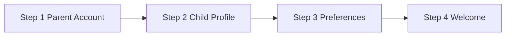

# KidsMind Web Client (React + TypeScript)

AI-powered, child-safe learning web client for ages 3–15 and parents.

- **Framework**: React 19 + TypeScript (strict)
- **Build**: Vite 7
- **Routing**: React Router DOM 7
- **Styling**: CSS Modules + CSS variables (light/dark themes)
- **State**: Local component state + custom hooks (no global store)
- **i18n**: 6 languages (`en`, `fr`, `es`, `it`, `ar`, `ch`)

---

## Quick Start

### Prerequisites

- Node.js **18+**
- npm **9+**

### Run locally

```bash
cd Apps/web
npm install
npm run dev
```

### Environment

- Copy `.env.example` to `.env` and set `VITE_API_BASE_URL` (default local API: `http://localhost:8000`).

### Auth + CSRF (web)

- Web auth uses cookie-based tokens (`access_token`, `refresh_token`) with `credentials: include`.
- After login, store `csrf_token` from response body in memory (fallback: read `csrf_token` cookie).
- Send `X-CSRF-Token` on mutating cookie-auth requests (`POST`, `PUT`, `PATCH`, `DELETE`).
- On refresh, replace stored CSRF token with the new `csrf_token` returned by the API.
- Do not persist CSRF token in localStorage.
## Routes

| Path | Page | Loading |
| --- | --- | --- |
| `/` | HomePage | Eager |
| `/login` | LoginPage | Lazy |
| `/get-started` | GetStartedPage | Lazy |
| `/error` | ErrorPage | Eager (error fallback route) |
| `*` | NotFoundPage | Lazy |

### Status + error handling

- `AppErrorBoundary` catches unexpected render/runtime errors and shows `ErrorPage`.
- Unknown routes are handled by `NotFoundPage` via wildcard route (`*`).
- Status page UI is centralized in `components/shared/StatusPage` for consistency and reuse.
- All status page strings are localized through `types/index.ts` + `utils/translations.ts`.
- Current status actions:
  - Not Found: `Go to home`, `Go back`
  - Error: `Go to home`, `Try again`

---

## How It Works

### Rendering flow

1. `main.tsx` mounts React app.
2. `App.tsx` defines router + suspense fallback.
3. Route page composes reusable components.
4. Business logic is isolated in hooks and utilities.

### State strategy

- **Local first** (`useState`) inside pages/components.
- Shared logic via custom hooks:
  - `useForm`
  - `useMultiStep`
  - `useTheme`
  - `useLanguage`
  - `useScrollPosition`
  - `useScrollReveal`
  - `useInterval`

### Navbar scroll behavior

- Navbar is visible on initial page load.
- Scrolling down past the hide threshold hides the navbar.
- Scrolling up reveals the navbar again with smooth transform animation.
- On mobile, the navbar stays visible while the menu drawer is open.

### Validation strategy

- All validators are pure functions in `src/utils/validators.ts`.
- Validators return **translation keys**, not hardcoded text.

---

## Project Structure (Compact)

```text
apps/web/
├── src/
│   ├── App.tsx                    # Main app component with routing
│   ├── main.tsx                   # Entry point that mounts React app
│   ├── index.css                  # Global styles
│   │
│   ├── pages/                     # Route-level page components
│   │   ├── HomePage/              # Landing page (eager loaded)
│   │   ├── LoginPage/             # Login page (lazy loaded)
│   │   ├── GetStartedPage/        # Multi-step registration wizard (lazy loaded)
│   │   ├── ErrorPage/             # Error fallback page
│   │   ├── NotFoundPage/          # 404 page (lazy loaded)
│   │   └── ParentProfilePage/     # Parent profile page
│   │
│   ├── components/                # Reusable UI components
│   │   ├── NavBar/                # Navigation bar with scroll behavior
│   │   ├── HeroSection/           # Home page hero
│   │   ├── Footer/                # Site footer
│   │   ├── LoginForm/             # Login form component
│   │   ├── GetStarted/            # Registration wizard steps
│   │   │   ├── StepParentAccount/ # Step 1: Parent account creation
│   │   │   ├── StepChildProfile/  # Step 2: Child profile setup
│   │   │   ├── StepPreferences/   # Step 3: Safety & preferences
│   │   │   ├── StepWelcome/       # Step 4: Confirmation screen
│   │   │   └── StepIndicator/     # Progress indicator
│   │   └── shared/                # Shared/reusable components
│   │       ├── AppErrorBoundary/  # Error boundary wrapper
│   │       ├── AuthLayout/        # Layout wrapper for auth pages
│   │       ├── FormField/         # Generic form field component
│   │       ├── PasswordField/     # Password input with strength meter
│   │       ├── AvatarPicker/      # Emoji avatar selector
│   │       ├── ProgressBar/       # Progress indicator
│   │       └── StatusPage/        # Reusable status/error page
│   │
│   ├── hooks/                     # Custom React hooks
│   │   ├── useForm.ts             # Generic form state management
│   │   ├── useMultiStep.ts        # Multi-step wizard navigation
│   │   ├── useLanguage.ts         # Language switching & RTL support
│   │   ├── useTheme.ts            # Light/dark theme toggle
│   │   ├── useScrollPosition.ts   # Navbar scroll visibility
│   │   ├── useScrollReveal.ts     # IntersectionObserver animations
│   │   ├── useInterval.ts         # Declarative setInterval
│   │   └── useAuthStatus.ts       # Authentication state
│   │
│   ├── utils/                     # Utility functions
│   │   ├── translations.ts        # Translation dictionaries (6 languages)
│   │   ├── validators.ts          # Pure validation functions
│   │   ├── constants.ts           # Static config & content arrays
│   │   ├── csrf.ts                # CSRF token helpers
│   │   ├── cssVariables.ts        # Theme variable application
│   │   ├── api.ts                 # API client configuration
│   │   ├── countries.ts           # Country data
│   │   └── childProfileRules.ts   # Child profile validation rules
│   │
│   ├── types/                     # TypeScript type definitions
│   │   └── index.ts               # Central type definitions
│   │
│   └── styles/                    # Global styles
│       ├── globals.css            # Global CSS
│       ├── themes.css             # Light/dark theme variables
│       └── animations.css         # Animation keyframes
│
├── public/                        # Static assets
├── index.html                     # HTML template
├── package.json                   # Dependencies & scripts
├── tsconfig.json                  # TypeScript configuration
├── tsconfig.app.json              # App-specific TS config
├── tsconfig.node.json             # Node-specific TS config
├── vite.config.ts                 # Vite build configuration
├── .env                           # Environment variables
├── .env.example                   # Example environment file
└── README.md                      # Project documentation
```

---

## Key Modules

### Hooks

| Hook | Responsibility |
| --- | --- |
| `useForm` | Generic form state + touched/errors/submission |
| `useMultiStep` | Step navigation + progress |
| `useTheme` | Light/dark state + localStorage persistence |
| `useLanguage` | Active language + RTL + translations |
| `useScrollPosition` | Navbar scroll behavior |
| `useScrollReveal` | IntersectionObserver reveal animations |
| `useInterval` | Declarative interval with cleanup |

### Utilities

| File | Responsibility |
| --- | --- |
| `utils/constants.ts` | Static app content/config arrays |
| `utils/csrf.ts` | CSRF token read/store/header helpers |
| `utils/translations.ts` | Translation dictionaries |
| `utils/validators.ts` | Pure validation rules |
| `utils/cssVariables.ts` | Theme application helper |

---

## Design System Snapshot

### Theme tokens (examples)

| Token | Light | Dark |
| --- | --- | --- |
| `--bg-primary` | `#FFF8F0` | `#0F0F1A` |
| `--bg-surface` | `#FFFFFF` | `#1A1A2E` |
| `--accent-main` | `#FF6B35` | `#FF8C5A` |
| `--text-primary` | `#2D2D2D` | `#F0EBE3` |

### Accessibility baseline

- WCAG-oriented labels and semantic structure
- `role="alert"` for form errors
- keyboard-friendly interactive controls
- reduced motion compatibility
- Arabic RTL support (`dir="rtl"`)

---

## Internationalization

- Supported languages: `en`, `fr`, `es`, `it`, `ar`, `ch`
- Active language is persisted in localStorage (`km_lang`)
- `useLanguage` sets document:
  - `lang`
  - `dir` (`ltr`/`rtl`)

---

## Onboarding Flow (Visual)



- Step progress is controlled by `useMultiStep`
- Form data is validated at each step before advancing

---

## Add a New Page (Fast Path)

1. Create page in `src/pages/<PageName>/<PageName>.tsx`
2. Lazy import page in `src/App.tsx`
3. Add `<Route path="..." element={<PageName />} />`
4. Add translation keys in `src/types/index.ts` + `src/utils/translations.ts` if needed

---

## Add a New Language (Fast Path)

1. Extend `LanguageCode` in `src/types/index.ts`
2. Add language metadata in `utils/constants.ts`
3. Add full translation map in `utils/translations.ts`
4. Set `dir: 'rtl'` for RTL languages and verify UI

---

## Engineering Rules

- Keep TypeScript strict-safe
- Prefer local state + custom hooks
- Use CSS Modules (avoid global leakage)
- Keep validation pure and reusable
- Avoid introducing global state library unless needed by product scope

---

## Forward Notes

- Keep `StatusPage` generic; create variant pages by composition instead of duplicating UI.
- For any new user-facing error/state screen, add translation keys in `types/index.ts` before implementing UI.
- Prefer lazy loading for low-frequency pages (like special status pages) unless required by fallback flow.
- Preserve accessibility baseline: semantic heading, clear actions, keyboard focus, and minimum 44px targets.

---

