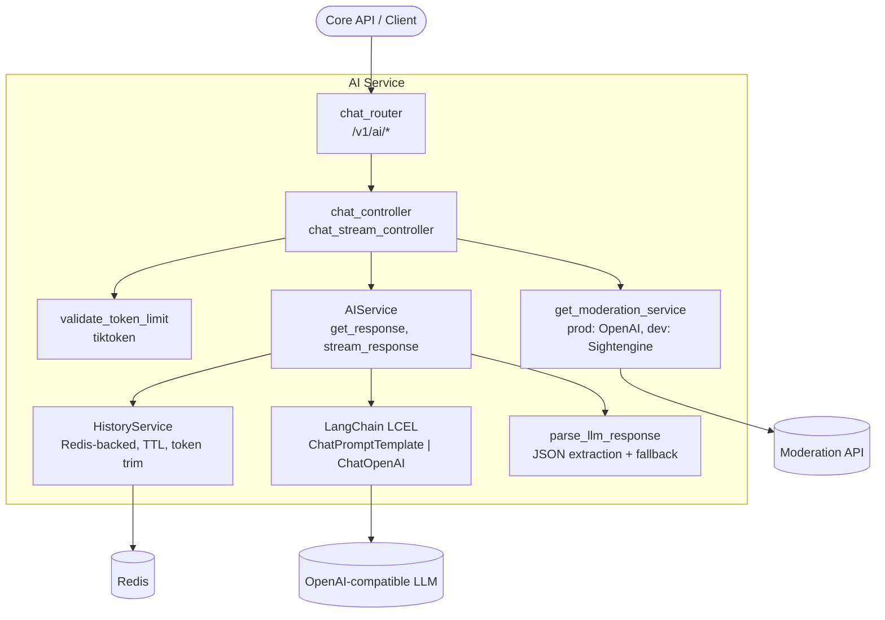
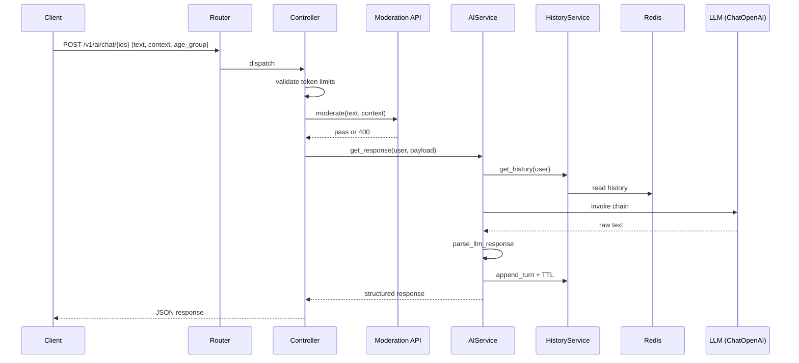

# KidsMind AI Service

## 1. Basics

- Service Name: ai-service
- Role: FastAPI microservice for child-safe educational chat (ages 3-15). Called by core-api.
- Primary Port (host): ${AI_PORT}(default:8001) 
- Docker Network Port (container): 8000
- Compose address from other services: http://ai-service:8000
- API Prefix: /v1/ai

## 2. Quick Start

### With pip (local)

1. Install dependencies:
   - pip install -r requirements.txt
2. Create environment file:
   - copy app/.env.example app/.env
3. Run service from services/ai/app:
   - uvicorn main:app --host 0.0.0.0 --port 8001 --reload


### With Docker Compose

1. Fill root .env and services/ai/app/.env.
2. Start service and Redis:
   - docker compose up ai-service cache

## 3. Service Dependencies & Topology

| Service | Purpose | Connection Method |
|---|---|---|
| core-api | Calls this service for AI features | HTTP inside compose network: http://ai-service:8000 |
| cache (Redis) | Conversation history persistence | redis://cache:6379 (password injected when CACHE_PASSWORD is set) |
| OpenAI-compatible LLM | Text generation | BASE_URL + API_KEY + MODEL_NAME |
| Moderation API (prod) | Input safety checks in production | GUARD_API_URL + GUARD_API_KEY + GUARD_MODEL_NAME |
| Sightengine (dev) | Input safety checks in development | DEV_GUARD_API_URL + DEV_GUARD_API_KEY + DEV_API_USER |
| Prometheus | Metrics scraping | GET /metrics |
| Promtail -> Loki -> Grafana | Centralized logs | JSON logs on stdout, collected by promtail |

### Service Map





## 4. API Documentation (FastAPI Edge)

- Swagger UI: /docs
- ReDoc: /redoc
- OpenAPI schema: /openapi.json

### API Endpoints

| Method | Endpoint | Description |
|---|---|---|
| GET | / | Health check (service + cache status) |
| GET | /metrics | Prometheus metrics |
| POST | /v1/ai/chat/{user_id}/{child_id}/{session_id} | Non-streaming chat response |
| POST | /v1/ai/chat/stream/{user_id}/{child_id}/{session_id} | SSE streaming chat response |
| GET | /v1/ai/history/{user_id}/{child_id}/{session_id} | Get conversation history |
| DELETE | /v1/ai/history/{user_id}/{child_id}/{session_id} | Clear conversation history |

### ChatRequest Schema

| Field | Type | Required | Default | Constraints |
|---|---|---|---|---|
| text | str | Yes | - | max_length=10000, <= 2000 tokens |
| context | str | No | None | max_length=5000, <= 1000 tokens |
| age_group | Literal["3-6","7-11","12-15","3-15"] | No | "3-15" | Controls tone and difficulty |

### LLM Response Structure

```json
{
  "explanation": "...",
  "example": "...",
  "exercise": "...",
  "encouragement": "..."
}
```

If model output is not valid JSON, the raw text is stored in explanation and the other fields are returned as empty strings.

## 5. Environment & Configuration

Use app/.env.example as the full template.

| Variable | Required | Notes |
|---|---|---|
| IS_PROD | No | Selects moderation provider: True = OpenAI, False = Sightengine |
| MODEL_NAME | Yes | LLM model id used by LangChain |
| BASE_URL | Yes | OpenAI-compatible inference endpoint |
| API_KEY | Yes | LLM credential |
| GUARD_API_KEY / GUARD_API_URL / GUARD_MODEL_NAME | Prod | Required together when IS_PROD=True |
| DEV_API_USER / DEV_GUARD_API_URL / DEV_GUARD_API_KEY | Dev | Required together when IS_PROD=False |
| SERVICE_TOKEN | Prod | Checked from X-Service-Token header by router dependency |
| CACHE_SERVICE_ENDPOINT | No | Redis URL (default redis://cache:6379) |
| CACHE_PASSWORD | No | If set, service injects password into Redis URL automatically |
| MAX_HISTORY_MESSAGES | No | Hard cap of stored messages |
| MAX_LOADED_HISTORY_MESSAGES | No | Limits preloaded history before token trimming |
| MAX_HISTORY_TOKENS | No | Token budget for history context |
| HISTORY_TTL_SECONDS | No | Exposed as HISTORY_TTL in settings via alias |
| CORS_ORIGINS | No | JSON array format, example: ["http://localhost:5173"] |
| LOG_LEVEL | No | Standard Python log levels |
| SERVICE_NAME | No | Included in structured log records |

## 6. Observability & Health Checks

- Health Check Endpoint: GET /
- Metrics Endpoint: GET /metrics
- Logging: JSON logs to stdout, forwarded by Promtail to Loki, visualized in Grafana
- Request Tracing: X-Request-ID is generated/propagated and returned in response headers

## Dependencies & Integrations

| Dependency / Service | Purpose | Required |
|---|---|---|
| fastapi / uvicorn | API framework and ASGI server | Yes |
| langchain-openai / langchain-core | Prompting and model invocation | Yes |
| langchain-community | RedisChatMessageHistory integration | Yes |
| tiktoken | Token counting for validation and history trimming | Yes |
| httpx | Async moderation API calls | Yes |
| redis (redis.asyncio) | Cache and history backend | Yes |
| pydantic-settings | Typed env configuration | Yes |
| prometheus-fastapi-instrumentator | /metrics exposure | Yes |

## Error Handling

- 422: token limits exceeded
- 400: moderation flagged content
- 500: moderation or model failure, or unhandled exception
- Redis unavailable: chat still works without history
- Non-JSON model output: fallback to explanation-only payload