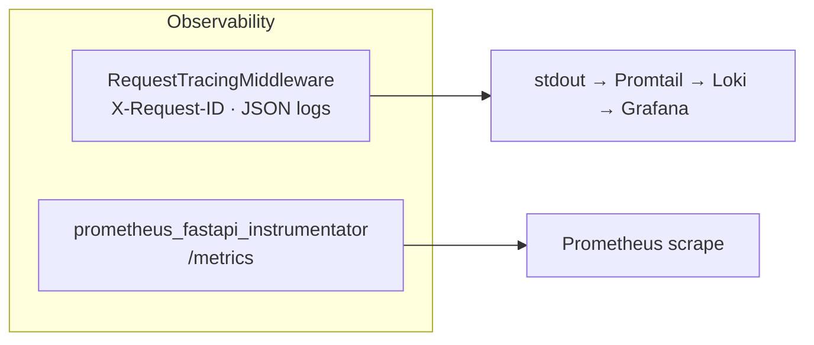
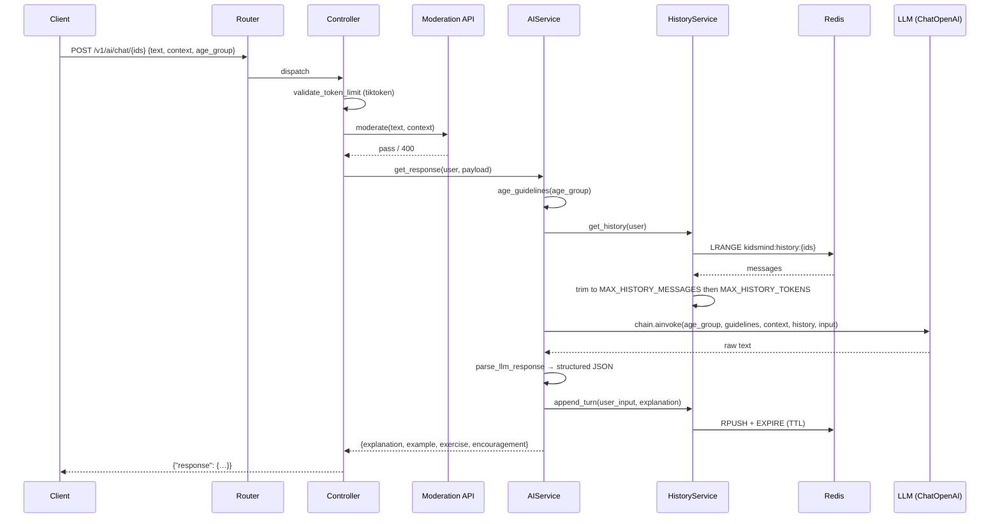

# KidsMind AI Service

## Overview

FastAPI microservice that powers the KidsMind educational assistant for children aged 3–15. Called by the core API gateway, it validates input tokens, moderates content through an external safety API, invokes an OpenAI-compatible LLM via LangChain, and returns structured JSON responses (or SSE streams) adapted to the child's age group. Conversation history is persisted in Redis with automatic token-budget trimming.

## Architecture




## API Reference

**Prefix:** `/v1/ai` &nbsp;|&nbsp; **Health:** `GET /` → `{"status": "ok"}` &nbsp;|&nbsp; **Metrics:** `GET /metrics` (Prometheus)

### Chat

| Method | Endpoint | Request Body | Response | Description |
|--------|----------|--------------|----------|-------------|
| `POST` | `/chat/{user_id}/{child_id}/{session_id}` | `ChatRequest` | `{"response": {…}}` | Full LLM response (non-streaming) |
| `POST` | `/chat/stream/{user_id}/{child_id}/{session_id}` | `ChatRequest` | SSE stream `data: …\n\n` | Streaming LLM response; ends with `data: [DONE]\n\n` |

### History

| Method | Endpoint | Request Body | Response | Description |
|--------|----------|--------------|----------|-------------|
| `GET` | `/history/{user_id}/{child_id}/{session_id}` | — | `{"messages": [{role, content}, …]}` | Retrieve session conversation history |
| `DELETE` | `/history/{user_id}/{child_id}/{session_id}` | — | `{"status": "cleared"}` | Clear session conversation history |

### `ChatRequest` Schema

| Field | Type | Required | Default | Constraints |
|-------|------|----------|---------|-------------|
| `text` | `str` | Yes | — | `max_length=10000`, ≤ 2000 tokens |
| `context` | `str` | No | `None` | `max_length=5000`, ≤ 1000 tokens |
| `age_group` | `Literal["3-6","7-11","12-15","3-15"]` | No | `"3-15"` | Controls tone/vocabulary/exercise style |

### LLM Response Structure

```json
{
  "explanation": "…",
  "example": "…",
  "exercise": "…",
  "encouragement": "…"
}
```

If the LLM returns non-JSON, the parser wraps the raw text into the `explanation` field with the remaining keys empty.

## Data Flow



For the **streaming** path, `chain.astream()` yields chunks as SSE events (`data: {chunk}\n\n`). After the stream ends, the accumulated response is parsed and history is saved identically.

## Configuration

Loaded via `pydantic_settings` from `.env`. A validator enforces that prod or dev moderation credentials are present based on `IS_PROD`.

| Variable | Required | Default | Description |
|----------|----------|---------|-------------|
| `IS_PROD` | No | `False` | `True` → OpenAI moderation; `False` → Sightengine |
| `MODEL_NAME` | Yes | — | LLM model identifier (e.g. `gpt-4o-mini`) |
| `BASE_URL` | Yes | — | OpenAI-compatible inference endpoint |
| `API_KEY` | Yes | — | LLM API key |
| `GUARD_API_KEY` | Prod | `None` | OpenAI moderation API key |
| `GUARD_API_URL` | Prod | `None` | OpenAI moderation endpoint |
| `GUARD_MODEL_NAME` | Prod | `None` | Moderation model name |
| `DEV_GUARD_API_KEY` | Dev | `None` | Sightengine API secret |
| `DEV_GUARD_API_URL` | Dev | `None` | Sightengine endpoint |
| `DEV_API_USER` | Dev | `None` | Sightengine API user |
| `CACHE_PASSWORD` | No | `None` | Redis password (auto-injected into URL) |
| `CACHE_SERVICE_ENDPOINT` | No | `redis://cache:6379` | Redis connection URL |
| `MAX_HISTORY_MESSAGES` | No | `16` | Max messages retained in context |
| `MAX_HISTORY_TOKENS` | No | `4096` | Max token budget for history |
| `HISTORY_TTL` | No | `3600` | Redis key TTL in seconds |
| `LOG_LEVEL` | No | `INFO` | Python log level |
| `RATE_LIMIT` | No | `100/minute` | Defined but not currently enforced in-app |
| `SERVICE_NAME` | No | `AI-service` | Identifier used in structured logs |

## Local Development

1. **Install** — `pip install -r requirements.txt` (or `uv sync` if using the `pyproject.toml`).
2. **Configure** — `cp app/.env.example app/.env` and fill in LLM + moderation credentials.
3. **Redis** — ensure a Redis instance is running at the configured `CACHE_SERVICE_ENDPOINT`.
4. **Run** — `uvicorn app.main:app --reload --port 8001`
5. **Verify** — `curl http://localhost:8001/` should return `{"status":"ok"}`.

## Docker

```bash
# Standalone
docker build -t kidsmind-ai ./services/ai
docker run --rm -p 8001:8000 --env-file ./services/ai/app/.env kidsmind-ai

# With full stack (from repo root)
docker compose up ai-service cache
```

The image uses a multi-stage build (`python:3.12-slim`), runs as non-root `appuser`, and pre-compiles bytecode.

## Dependencies & Integrations

| Dependency / Service | Purpose | Required |
|----------------------|---------|----------|
| `fastapi` / `uvicorn` | ASGI framework and server | Yes |
| `langchain-openai` / `langchain-core` | LLM client, prompt templates, LCEL chain | Yes |
| `langchain-community` | `RedisChatMessageHistory` for conversation persistence | Yes |
| `tiktoken` | Token counting for input validation and history trimming | Yes |
| `httpx` | Async HTTP client for moderation API calls (shared via lifespan) | Yes |
| `redis` (`redis.asyncio`) | Async cache client for session history | Yes |
| `pydantic-settings` | Typed configuration from `.env` files | Yes |
| `prometheus-fastapi-instrumentator` | Auto HTTP metrics at `/metrics` | Yes |
| Redis instance | Conversation history storage (graceful degradation if unavailable) | Recommended |
| OpenAI Moderation API | Production content safety (when `IS_PROD=True`) | Prod |
| Sightengine API | Development content safety (when `IS_PROD=False`) | Dev |
| Any OpenAI-compatible LLM endpoint | Inference backend (`BASE_URL`) | Yes |

## Error Handling

- **`422 Unprocessable Entity`** — input `text` exceeds 2000 tokens or `context` exceeds 1000 tokens (tiktoken validation).
- **`400 Bad Request`** — content flagged by moderation. Response detail includes the flagged category. Applied to user input before inference.
- **`500 Internal Server Error`** — LLM invocation failure, moderation API unreachable, or any unhandled exception. All caught via a `try/except HTTPException: raise` → `except Exception` → 500 pattern.
- **Fail-closed moderation** — if the moderation API itself errors, the request is rejected (500), never silently passed.
- **Redis graceful degradation** — if Redis is unavailable, chat endpoints continue without conversation history (logged as warning).
- **LLM retries** — `ChatOpenAI` is configured with `max_retries=2` and `timeout=30s`; transient LLM failures are retried automatically by the SDK.
- **JSON parse fallback** — if the LLM returns non-JSON, the raw text is wrapped as `{"explanation": <raw>, "example": "", "exercise": "", "encouragement": ""}` rather than failing.
- **Request tracing** — every response includes an `X-Request-ID` header (propagated from upstream or generated as UUID4) for cross-service log correlation.
