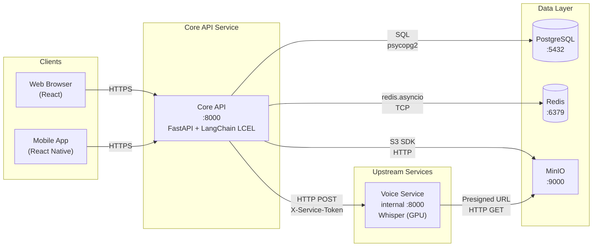

# KidsMind Core API

   

KidsMind Core API is the single client-facing entry point for all web and mobile traffic. It owns authentication, child profile logic, parental safety controls, chat orchestration, and AI inference. Audio transcription is delegated to the voice service. Clients never call upstream services directly. By default, only `core-api` is published; others stay private on the internal Docker network unless localhost debug ports are enabled with `docker-compose.debug.yml`.



## Quick Start

*Start dependencies, apply migrations, run the API, verify with health check.*

### Local pip

1. ```bash
   pip install -r requirements.txt
   ```
2. Copy `app/.env.example` to `app/.env` and fill secrets.

3. ```bash
   docker compose up -d database cache file-storage voice-service
   ```
4. ```bash
   alembic upgrade head
   ```
5. ```bash
   uvicorn main:app --host 0.0.0.0 --port 8000 --reload
   ```
6. ```bash
   curl http://localhost:8000/
   ```

### Docker Compose

1. Copy `.env.example` to `.env` (repo root) and `app/.env.example` to `app/.env`; fill secrets.

2. ```bash
   docker compose up -d --build
   ```
3. ```bash
   docker compose up --force-recreate --no-deps bucket-provisioner
   ```
4. ```bash
   curl http://localhost:8000/
   ```

Expected: `{"status":"ok","cache":"ok"}`

Local-only debug ports for voice/DB/MinIO/observability:

```bash
docker compose -f docker-compose.yml -f docker-compose.debug.yml up -d
```

## Request Pipeline

*Every request passes through five middleware layers before reaching business logic. Middleware is registered in reverse order — the last added is the outermost (closest to the client).*

```text
Client → CORS → Tracing → CSRF → Rate Limit → Auth → Router → Controller → Service → DB / Cache / Storage / Voice
```

| Layer | What it does | Rejects with |
|---|---|---|
| CORS | Origin and header whitelist checks | Browser blocks request |
| Tracing | Attaches `X-Request-ID` to request | Non-blocking |
| CSRF | Cookie/header double-submit for web state-changing requests | `403` |
| Rate limit | Tiered Redis-backed quota check | `429` |
| Auth | JWT decode, audience validation, blocklist check, user lookup | `401` / `403` |

## API Reference

*Routers define HTTP contracts; controllers orchestrate; services execute domain logic. Full schemas at `/docs`.*

### Auth Web

| Method | Path | Auth | Rate Tier | Description |
|---|---|---|---|---|
| POST | `/api/web/auth/register` | No | T3 | Register + set cookies + CSRF |
| POST | `/api/web/auth/login` | No | T3 | Login + set cookies + CSRF |
| POST | `/api/web/auth/refresh` | Refresh cookie + CSRF | T2 | Rotate refresh tokens |
| POST | `/api/web/auth/logout` | Access cookie + CSRF | T3 | Revoke + clear cookies |

### Auth Mobile

| Method | Path | Auth | Rate Tier | Description |
|---|---|---|---|---|
| POST | `/api/mobile/auth/register` | No | T3 | Register + return bearer tokens |
| POST | `/api/mobile/auth/login` | No | T3 | Login + return bearer tokens |
| POST | `/api/mobile/auth/refresh` | Refresh token in body | T2 | Rotate refresh tokens |
| POST | `/api/mobile/auth/logout` | Bearer + refresh in body | T3 | Revoke submitted refresh |

### Users

| Method | Path | Auth | Rate Tier | Description |
|---|---|---|---|---|
| GET | `/api/v1/users/me` | Access token | T1 | Full user profile |
| GET | `/api/v1/users/me/summary` | Access token | T1 | User summary |
| DELETE | `/api/v1/users/me` | Access token | T4 | Soft delete account |
| POST | `/api/v1/users/logout-all` | Access token | T3 | Revoke all sessions |

### Admin Users

| Method | Path | Auth | Rate Tier | Description |
|---|---|---|---|---|
| GET | `/api/v1/users/` | Admin | T1 | List users |
| GET | `/api/v1/users/{user_id}` | Admin | T1 | Get user |
| GET | `/api/v1/users/{parent_id}/children` | Admin | T1 | List parent's children |
| PATCH | `/api/v1/users/{user_id}` | Admin | T4 | Patch user |
| DELETE | `/api/v1/users/{user_id}/hard` | Admin | T4 | Hard delete user |
| PATCH | `/api/v1/users/{parent_id}/children/{child_id}` | Admin | T4 | Patch child |
| DELETE | `/api/v1/users/{parent_id}/children/{child_id}/hard` | Admin | T4 | Hard delete child |

### Children

| Method | Path | Auth | Rate Tier | Description |
|---|---|---|---|---|
| POST | `/api/v1/children` | Access token | T4 | Create child (max 5) |
| GET | `/api/v1/children` | Access token | T1 | List children |
| GET | `/api/v1/children/{child_id}` | Access token | T1 | Get child |
| PATCH | `/api/v1/children/{child_id}` | Access token | T4 | Update child + invalidate cache |
| PATCH | `/api/v1/children/{child_id}/rules` | Access token (parent) | T4 | Update rules + invalidate cache |
| DELETE | `/api/v1/children/{child_id}` | Access token | T4 | Delete child + invalidate cache |

### Chat

| Method | Path | Auth | Rate Tier | Description |
|---|---|---|---|---|
| POST | `/api/v1/chat/text/{user_id}/{child_id}/{session_id}` | Access + ownership | T5 | Text chat (SSE optional) |
| POST | `/api/v1/chat/voice/{user_id}/{child_id}/{session_id}` | Access + ownership | T5 | Voice chat (SSE optional) |
| GET | `/api/v1/chat/history/{user_id}/{child_id}/{session_id}` | Access + ownership | T1 | Get chat history |
| DELETE | `/api/v1/chat/history/{user_id}/{child_id}/{session_id}` | Access + ownership | T4 | Clear chat history |

### Media

| Method | Path | Auth | Rate Tier | Description |
|---|---|---|---|---|
| POST | `/api/v1/media/upload` | Admin | T4 | Upload media asset |
| GET | `/api/v1/media/download/{media_id}` | Access token | T1 | Download / presigned URL |

### Admin Media

| Method | Path | Auth | Rate Tier | Description |
|---|---|---|---|---|
| GET | `/api/v1/media/admin/avatars` | Admin | T1 | List all avatars |
| PATCH | `/api/v1/media/admin/avatars/{media_id}` | Admin | T4 | Update avatar + invalidate cache |
| DELETE | `/api/v1/media/admin/avatars/{media_id}` | Admin | T4 | Delete avatar + invalidate cache |
| PATCH | `/api/v1/media/admin/avatar-thresholds` | Admin | T4 | Update avatar tier thresholds |
| GET | `/api/v1/media/admin/badges` | Admin | T1 | List all badges |
| PATCH | `/api/v1/media/admin/badges/{media_id}` | Admin | T4 | Update badge + invalidate cache |
| DELETE | `/api/v1/media/admin/badges/{media_id}` | Admin | T4 | Delete badge + invalidate cache |

### Voice

| Method | Path | Auth | Rate Tier | Description |
|---|---|---|---|---|
| POST | `/api/v1/voice/{user_id}/{child_id}/{session_id}/transcribe` | Access + ownership | STT | Transcribe audio with optional SSE streaming |

### Quiz

| Method | Path | Auth | Rate Tier | Description |
|---|---|---|---|---|
| POST | `/api/v1/quizzes/{child_id}/submit` | Access token | T4 | Submit quiz answers for scoring |

### Safety and Rules

| Method | Path | Auth | Rate Tier | Description |
|---|---|---|---|---|
| PATCH | `/api/v1/safety-and-rules` | Access token | T4 | Update safety settings and child rules |
| POST | `/api/v1/safety-and-rules/verify-parent-pin` | Access token | T3 | Verify parent PIN for child mode access |

## Auth Model

*Tokens are the currency of trust — web locks them in cookies, mobile carries them as bearer credentials.*

### Web Cookie Auth

- Access and refresh tokens travel in **HttpOnly cookies** — JavaScript cannot read them.
- A **non-HttpOnly `csrf_token` cookie** is set on login; JS reads it and sends the value as `X-CSRF-Token` header on every state-changing request (double-submit pattern).
- Access cookie is scoped to path `/api`; refresh cookie to `/api/web/auth` only.
- When the access token expires, the browser silently calls `/refresh` — the refresh cookie is still valid.
- Logout blocklists the access token JTI in Redis and revokes the refresh session in DB, then clears all cookies (`max_age=0`).

### Mobile Bearer Auth

- Tokens travel as **JSON in the response body**; the app stores them in Keychain / Keystore.
- **No CSRF** — mobile apps are not vulnerable to browser CSRF attacks.
- Access token TTL: 15 min; refresh token TTL: 30 days.
- `X-Device-Info` header on register/login enables session tracking; `X-Device-ID` enables per-device rate limiting on refresh.
- At most `MOBILE_MAX_ACTIVE_SESSIONS` (default 10) concurrent refresh sessions per user; oldest are auto-revoked.

### Web vs Mobile

| | Web | Mobile |
|---|---|---|
| Token transport | HttpOnly cookies | JSON body (bearer tokens) |
| CSRF | Required on state-changing requests | Not required |
| Audience claim | `web-client` | `mobile-client` |
| Access TTL | 15 min | 15 min |
| Refresh TTL | 7 days | 30 days |
| Refresh delivery | Cookie (auto-sent) | Request body `refresh_token` |
| Session cap | No hard cap | 10 (configurable) |
| Logout revocation | Blocklist JTI + revoke refresh | Revoke refresh session only |

## Security Model

*Defense in depth: every layer from password hashing to token revocation is independently enforceable.*

- **Argon2id** password hashing — memory-hard, OWASP recommended, prevents brute-force even if DB leaks.
- **JWT audience separation** — `web-client` and `mobile-client` audiences are enforced at decode; a web token cannot authenticate a mobile request.
- **CSRF double-submit** — cookie value must match `X-CSRF-Token` header; skips safe methods and Bearer-auth requests.
- **Refresh token rotation** — each refresh issues a new pair and increments `generation`; reuse of a stale token revokes the entire family.
- **Access token blocklist** — Redis key keyed by JTI with TTL equal to remaining token expiry; checked on every authenticated request.
- **`token_valid_after`** — account-wide timestamp; any token issued before it is rejected. Updated on password change, email change, and logout-all.
- **Mobile session cap** — `MOBILE_MAX_ACTIVE_SESSIONS` (default 10) limits concurrent refresh sessions; oldest revoked on overflow.
- **Dummy hash timing** — unknown emails verify against a pre-configured Argon2 hash to prevent enumeration via response time.
- **Inter-service auth** — `X-Service-Token` header validated with `secrets.compare_digest` on upstream services.
- **Input validation** — Pydantic strict schemas with `extra="forbid"`; regex validation on passwords and emails.

## Redis Usage

*Redis serves four roles: rate limit counters, token blocklist, login lockout, and domain cache.*

| Key pattern | Purpose | TTL |
|---|---|---|
| `child:profile:{child_id}` | Child context cache for chat | 3600s |
| `media:avatars:base:v1` | Base avatar list for new profiles | 3600s |
| `auth:blocklist:access:{jti}` | Revoked access token JTI | Remaining token expiry |
| `auth:login:failures:ip:{ip}` | Login failure counter per IP | Lockout TTL |
| `auth:login:lockout:ip:{ip}` | IP lockout flag | Lockout TTL |
| `{prefix}:rate:{tier}:{endpoint_id}:{key_kind}:{identifier}:{window}` | Rate limit counter | Window duration |
| `{prefix}:lockout:{operation}:{identifier_hash}` | Endpoint-level lockout | Lockout TTL |

Dev keys use `dev:rl:` prefix; prod uses `rl:`.

```bash
redis-cli DEL "child:profile:<child_id>"          # invalidate child cache
redis-cli DEL "media:avatars:base:v1"              # invalidate avatar cache
redis-cli KEYS "dev:rl:*" | xargs redis-cli DEL   # clear dev rate limits
redis-cli KEYS "rl:*" | xargs redis-cli DEL        # clear prod rate limits
```

## Database & Migrations

*Schema evolution is migration-first; `init_db()` convenience creates tables on first local boot but is not a substitute for Alembic.*

Core tables:

- `users` — identities, roles, consent, auth state, lockout counters, `token_valid_after`.
- `child_profiles` — parent-owned learning profiles with age/stage alignment flags.
- `child_rules` — one-to-one parental controls per child (daily limits, subject allow/block, schedule, safety level).
- `refresh_token_sessions` — refresh lineage (`family_id`, `generation`), session metadata, replay flags.

Run from `services/api`:

```bash
alembic upgrade head              # apply all pending migrations
alembic revision --autogenerate -m "desc"  # generate new migration from model changes
alembic history --verbose         # inspect migration chain
```

> If schema is current but Alembic revision is untracked (e.g. existing DB), run `alembic stamp head` before normal upgrades.

## Observability

*Every request is measurable and traceable with structured metadata.*

| Endpoint | Auth | Purpose |
|---|---|---|
| `GET /` | No | Health + Redis reachability |
| `GET /metrics` | No | Prometheus scrape |

Log format (JSON lines, skipped for `/metrics`, `/health`, `/favicon.ico`):

```json
{
  "timestamp": "2024-01-15T10:30:00.123456+00:00",
  "level": "INFO",
  "service": "KidsMind API Service",
  "module": "request_tracing",
  "request_id": "a1b2c3d4-...",
  "message": "request completed",
  "http_method": "POST",
  "http_path": "/api/web/auth/login",
  "client_ip": "192.168.1.42",
  "status_code": 200,
  "duration_s": 0.142
}
```

Key production rate limits:

| Endpoint | Limit |
|---|---|
| Login (web + mobile) | IP 20/15m + credential 8/15m |
| Register (web + mobile) | IP 10/h + credential 3/h |
| Web refresh | 40/min + 600/h per user |
| Mobile refresh | 20/min (user + device) + 300/h |
| Chat text | 6/min burst, 30/h sustained, 100/day |
| Voice transcription | 10/min burst, 60/h sustained, 200/day |

Dev mode multiplies all limits by `DEV_MULTIPLIER` (default 1000).

## Project Structure

```text
services/api/
├── alembic/
│   ├── env.py              # Detects container vs localhost, loads .env files
│   ├── script.py.mako      # Migration template
│   └── versions/
├── app/
│   ├── controllers/        # Multi-service orchestration
│   ├── core/               # Config, database, cache, logging, rate limit policy
│   ├── dependencies/       # FastAPI Depends() providers
│   ├── middlewares/        # CSRF + rate-limit pipeline
│   ├── models/             # SQLAlchemy ORM models
│   ├── routers/            # HTTP routes by domain
│   ├── schemas/            # Pydantic request/response contracts
│   ├── services/           # Business/domain operations
│   ├── utils/              # Cross-cutting utilities
│   ├── main.py             # App factory, middleware wiring, lifespan
│   └── .env.example
├── Dockerfile              # Multi-stage build, runs as non-root appuser
├── requirements.txt
└── alembic.ini
```

## Contributing

*Adding a route touches six files in a fixed order.*

1. Define request/response schema in `app/schemas/`.
2. Implement domain logic in `app/services/`.
3. Add router endpoint in `app/routers/`; add controller in `app/controllers/` if orchestration across services is needed.
4. Register the router in `app/main.py` if it is a new route group.
5. Add an endpoint rule in `core/rate_limit_policy.py` to assign a rate tier.
6. Run `alembic revision --autogenerate -m "desc"` and `alembic upgrade head` for any model changes.