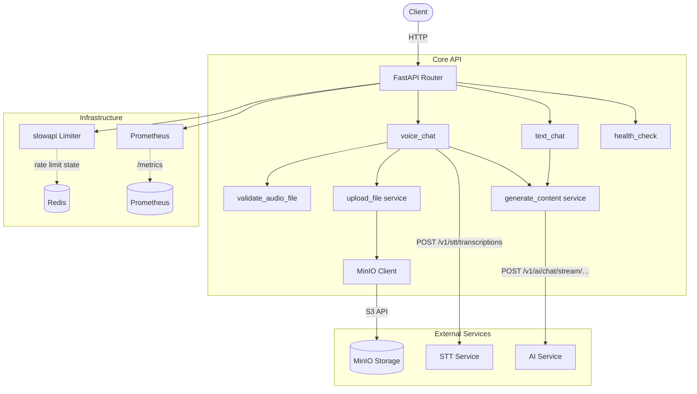
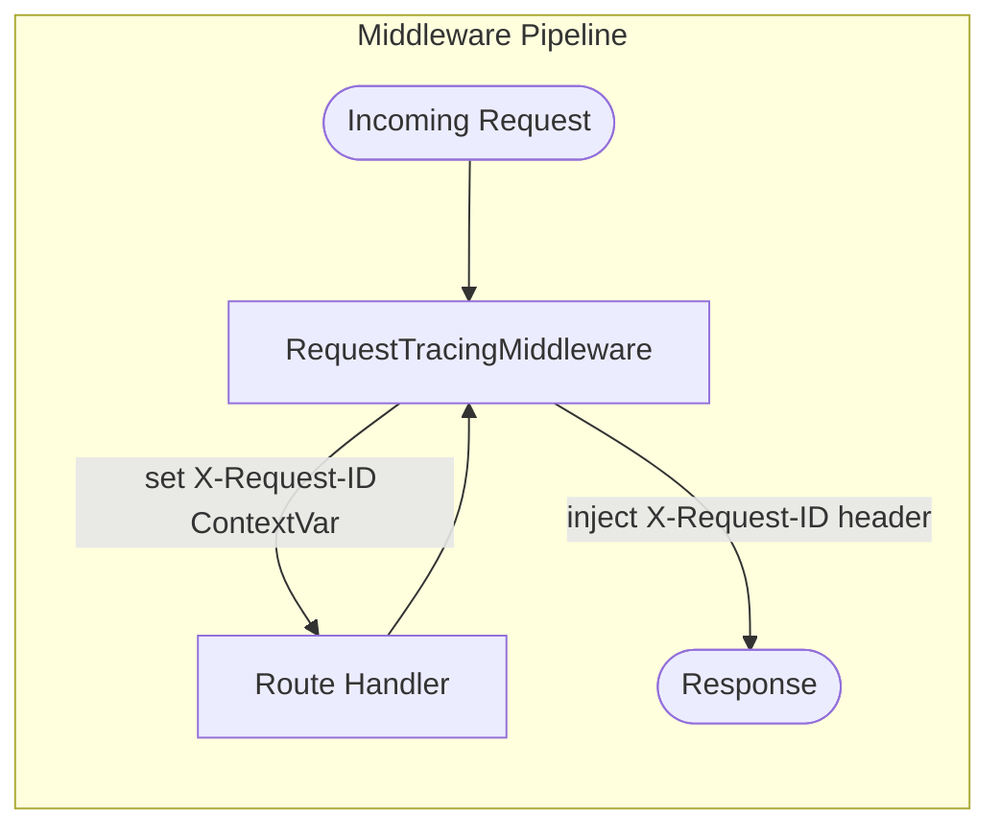
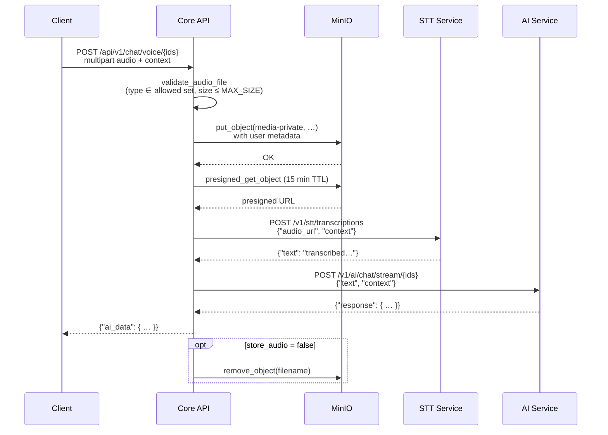
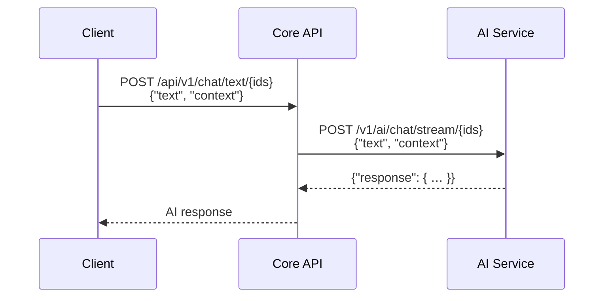

# Core API Service

## Overview

Gateway microservice that orchestrates voice and text chat for the KidsMind platform. Mobile/web clients send audio or text; this service handles file storage (MinIO), speech-to-text delegation, and AI content generation by coordinating the STT, AI, and Storage services behind a single API surface. Built with FastAPI, instrumented with Prometheus, rate-limited via Redis-backed slowapi, and structured-JSON-logged with per-request trace IDs.

## Architecture





## API Reference

### Health

| Method | Endpoint | Request Body | Response | Description |
|--------|----------|-------------|----------|-------------|
| GET | `/` | — | `{"status": "ok"}` | Health check (rate-limited: 10/min) |
| GET | `/metrics` | — | Prometheus text | Prometheus metrics (auto-exposed) |

### Chat (`/api/v1/chat`)

| Method | Endpoint | Request Body | Response | Description |
|--------|----------|-------------|----------|-------------|
| POST | `/voice/{user_id}/{child_id}/{session_id}` | `multipart/form-data`: `audio_file` (required), `context` (str, optional), `store_audio` (bool, default `true`) | `{"ai_data": { ... }}` | Upload audio → STT transcription → AI response |
| POST | `/text/{user_id}/{child_id}/{session_id}` | `{"text": "...", "context": "..."}` | AI response object | Send text directly → AI response |

**Path parameters** (all strings): `user_id`, `child_id`, `session_id` — identify the user, child profile, and conversation session.

## Data Flow

### Voice Chat — Critical Path



### Text Chat



## Configuration

| Variable | Required | Default | Description |
|----------|----------|---------|-------------|
| `IS_PROD` | No | `False` | Production mode flag |
| `SERVICE_NAME` | No | `KidsMind API Service` | Name used in structured log output |
| `STT_SERVICE_ENDPOINT` | No | `http://stt-service:8000` | STT microservice base URL |
| `STORAGE_SERVICE_ENDPOINT` | No | `http://storage-service:9000` | MinIO/S3 storage endpoint |
| `AI_SERVICE_ENDPOINT` | No | `http://ai-service:8000` | AI microservice base URL |
| `DB_SERVICE_ENDPOINT` | No | `http://db:5432` | Database endpoint (configured, not yet used) |
| `MAX_SIZE` | No | `10485760` (10 MB) | Maximum upload file size in bytes |
| `ALLOWED_CONTENT_TYPES` | No | `audio/mpeg, audio/wav, audio/x-wav, audio/mp3` | Accepted audio MIME types |
| `STORAGE_ROOT_USERNAME` | No | `admin` | MinIO access key |
| `STORAGE_ROOT_PASSWORD` | **Yes** | — | MinIO secret key (validated non-empty) |
| `CACHE_PASSWORD` | **Yes** | — | Redis password for rate limiter (validated non-empty) |
| `LOG_LEVEL` | No | `INFO` | Python log level |
| `RATE_LIMIT` | No | `100/minute` | Default rate limit per IP (slowapi format) |

## Local Development

1. **Install dependencies** (Python 3.12+):
   ```bash
   cd Services/api/app
   pip install -r ../requirements.txt
   ```

2. **Set environment variables** — create `Services/api/app/.env`:
   ```env
   STORAGE_ROOT_PASSWORD=your-minio-secret
   CACHE_PASSWORD=your-redis-password
   STT_SERVICE_ENDPOINT=http://localhost:8001
   AI_SERVICE_ENDPOINT=http://localhost:8002
   STORAGE_SERVICE_ENDPOINT=http://localhost:9000
   ```

3. **Run**:
   ```bash
   uvicorn main:app --reload --port 8000
   ```

## Docker

```bash
docker build -t kidsmind-api Services/api/
docker run -p 8000:8000 \
  -e STORAGE_ROOT_PASSWORD=secret \
  -e CACHE_PASSWORD=secret \
  kidsmind-api
```

## Dependencies & Integrations

| Dependency / Service | Purpose | Required |
|---------------------|---------|----------|
| **STT Service** | Speech-to-text transcription of uploaded audio | Yes (voice chat) |
| **AI Service** | LLM-powered content generation | Yes |
| **MinIO** | S3-compatible object storage for audio files | Yes (voice chat) |
| **Redis** | Rate limiter backend (slowapi) | Yes |
| **httpx** | Async HTTP client for inter-service calls | Built-in |
| **slowapi** | IP-based rate limiting | Built-in |
| **prometheus-fastapi-instrumentator** | `/metrics` endpoint for Prometheus scraping | Built-in |
| **pydantic-settings** | Typed config from env vars / `.env` files | Built-in |

## Error Handling

- **`413 Payload Too Large`** — uploaded file exceeds `MAX_SIZE`
- **`415 Unsupported Media Type`** — audio file MIME type not in `ALLOWED_CONTENT_TYPES`
- **`429 Too Many Requests`** — rate limit exceeded (slowapi auto-handler)
- **`500 Internal Server Error`** — unexpected payload from upstream (`KeyError`), MinIO `S3Error`, or unhandled exception
- **`502 Bad Gateway`** — upstream service unreachable (`httpx.RequestError`) or returned an error (`httpx.HTTPStatusError`)
- All upstream errors are caught by the `handle_service_errors` async context manager, which logs the original error and translates it to the appropriate HTTP status
- STT returning empty text triggers a `500` with detail `"STT Service did not return text"`
- Audio cleanup (`remove_audio`) runs in a `finally` block when `store_audio=false`, ensuring temp files are deleted even on failure
- Request tracing middleware injects `X-Request-ID` into every response for end-to-end correlation
