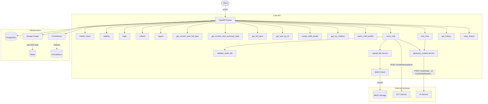
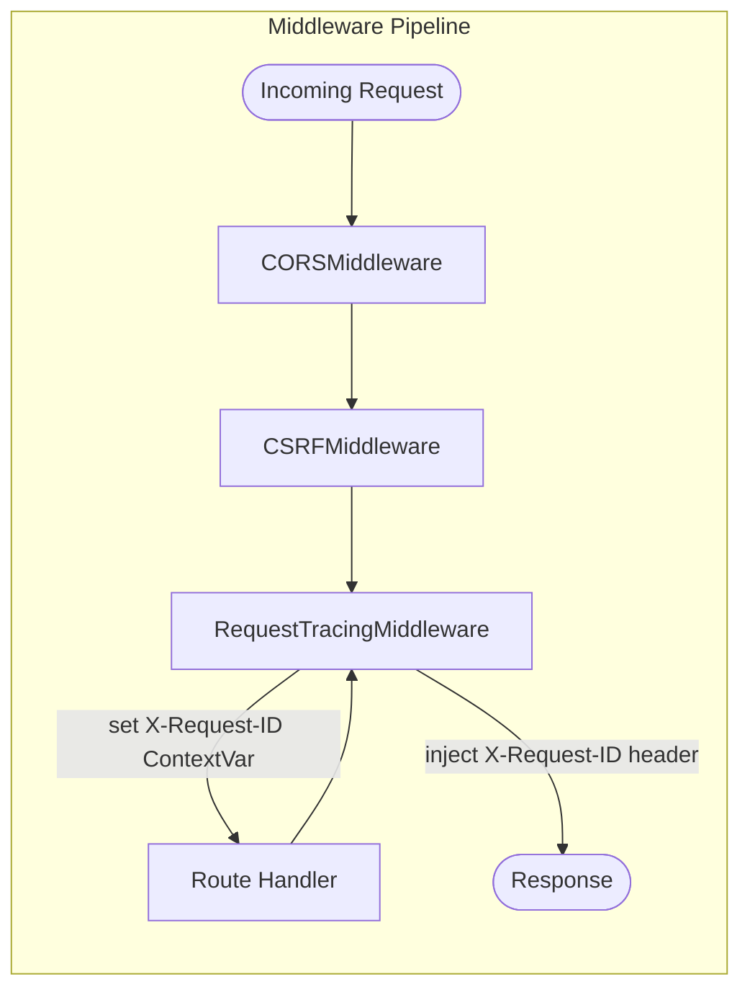
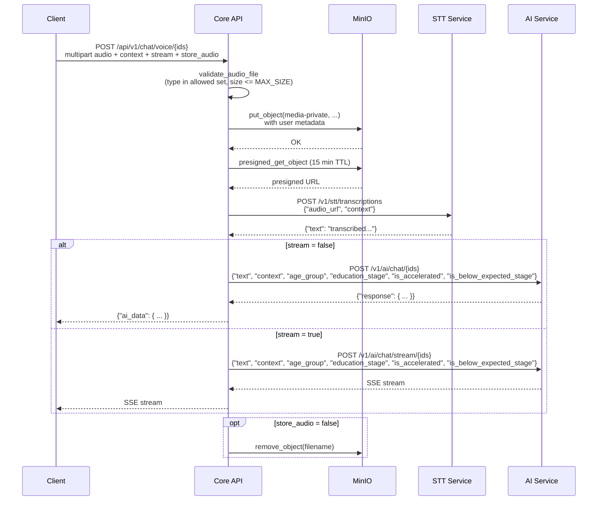
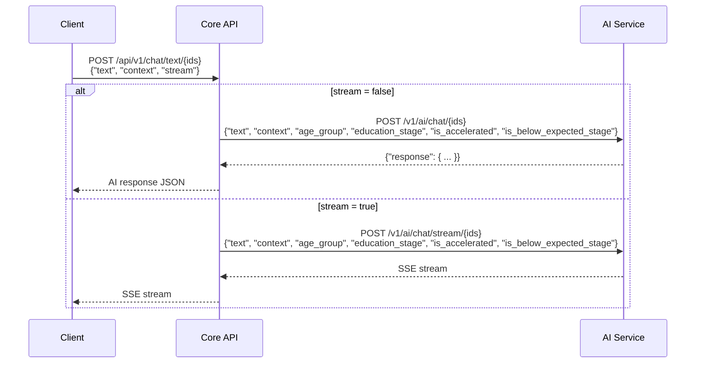

# Core API Service

## Overview

Gateway microservice for KidsMind authentication, parent/child profile management, and chat orchestration. It exposes a single API surface for web/mobile clients, handles auth tokens and CSRF for browser flows, and coordinates STT, AI, storage, database, and cache integrations. Built with FastAPI, instrumented with Prometheus, rate-limited with slowapi (Redis), and structured-JSON-logged with per-request trace IDs.

## Architecture





## API Reference

### Health

| Method | Endpoint | Request Body | Response | Description |
|--------|----------|-------------|----------|-------------|
| GET | `/` | - | `{"status": "ok", "cache": "ok or unreachable"}` | Health check |
| GET | `/metrics` | - | Prometheus text | Prometheus metrics scrape endpoint |

### Auth (`/api/v1/auth`)

Client type is resolved from `X-Client-Type: web|mobile` (defaults to `mobile` when omitted).

| Method | Endpoint | Request | Web Behavior | Mobile Behavior |
|--------|----------|---------|--------------|-----------------|
| POST | `/register` | `{"email":"...","password":"...","country":"...","default_language":"fr","timezone":"UTC","consents":{"terms":true,"data_processing":true,"analytics":false},"parent_pin":"1234"}` | Same behavior as mobile response body | Returns `id`, `email`, `role`, `created_at` |
| POST | `/login` | `{"email":"...","password":"..."}` | Sets `access_token` + `refresh_token` (HttpOnly) and `csrf_token` (non-HttpOnly); returns `message`, `user`, `csrf_token` | Returns JSON tokens (`access_token`, `refresh_token`, `token_type`, `expires_in`, `user`) |
| POST | `/refresh` | Optional body `{"refresh_token":"..."}` | Uses `refresh_token` cookie; rotates auth cookies and returns new `csrf_token` | Reads refresh token from `Authorization: Bearer <refresh_token>` then body fallback; returns rotated JSON tokens |
| POST | `/logout` | Optional body `{"refresh_token":"..."}` | Clears auth + csrf cookies and returns logout message | Revokes provided refresh token when present; refresh token required for mobile |

#### Auth and CSRF behavior by environment

- In production (`IS_PROD=true`):
  - Protected endpoints require valid authentication.
  - `web` auth source: `access_token` cookie.
  - `mobile` auth source: `Authorization: Bearer <access_token>`.
  - CSRF is enforced for mutating web requests using auth cookies (`csrf_token` cookie + `X-CSRF-Token` header).
- In non-production (`IS_PROD=false`):
  - Most authenticated routes can run without credentials using first active user fallback.
  - Strict auth is still required for:
    - `GET /api/v1/users/me`
    - `GET /api/v1/users/me/summary`

#### Auth security notes

- Access token lifetime defaults to `900` seconds.
- Refresh token lifetime defaults to `604800` seconds.
- CSRF token lifetime defaults to `604800` seconds.
- Refresh tokens are persisted server-side with token-family rotation metadata.
- Reuse detection revokes active refresh sessions in the same family.
- For browser cookies, frontend must include credentials (`fetch(..., { credentials: "include" })` or axios `withCredentials: true`).

### Users (`/api/v1/users`)

| Method | Endpoint | Request Body | Response | Description |
|--------|----------|-------------|----------|-------------|
| GET | `/me` | - | `UserFullResponse` | Authenticated user full profile  |
| GET | `/me/summary` | - | `UserSummaryResponse` | Authenticated user minimal profile  |
| GET | `/` | - | `UserFullResponse[]` | List users (admin/super-admin only in prod; open in non-prod) |
| GET | `/{user_id}` | - | `UserFullResponse` | Get user by id (admin/super-admin only in prod) |

### Children (`/api/v1/children`)

| Method | Endpoint | Request Body | Response | Description |
|--------|----------|-------------|----------|-------------|
| POST | `POST /api/v1/children` | `{"nickname":"...","birth_date":"2017-05-12","education_stage":"PRIMARY","languages":["fr","en"],"avatar":"...","settings_json":{}}` | `ChildProfileResponse` | Create child profile for current parent |
| GET | `GET /api/v1/children` | - | `ChildProfileResponse[]` | List children for current parent |
| PATCH | `PATCH /api/v1/children/{child_id}` | Partial child payload | `ChildProfileResponse` | Update child profile owned by current parent |

Child validation constraints:
- `birth_date`: must correspond to age 3-15
- `education_stage`: `KINDERGARTEN`, `PRIMARY`, `SECONDARY`
- `languages`: at least one non-empty value
- Payload models use `extra="forbid"`

### Chat (`/api/v1/chat`)

| Method | Endpoint | Request Body | Response | Description |
|--------|----------|-------------|----------|-------------|
| POST | `/voice/{user_id}/{child_id}/{session_id}` | `multipart/form-data`: `audio_file` (required), `context` (optional), `stream` (bool), `store_audio` (bool) | JSON when `stream=false`, SSE when `stream=true` | Upload audio -> STT transcription -> AI response |
| POST | `/text/{user_id}/{child_id}/{session_id}` | `{"text":"...","context":"...","stream":false}` | JSON when `stream=false`, SSE when `stream=true` | Send text directly -> AI response |
| GET | `/history/{user_id}/{child_id}/{session_id}` | - | Upstream history payload | Fetch conversation history |
| DELETE | `/history/{user_id}/{child_id}/{session_id}` | - | Upstream clear payload | Clear conversation history |

Path parameters (all strings): `user_id`, `child_id`, `session_id`.


## Data Flow

### Voice Chat - Critical Path



### Text Chat



## Configuration

| Variable | Required | Default | Description |
|----------|----------|---------|-------------|
| `IS_PROD` | No | `False` | Production mode flag |
| `SERVICE_NAME` | No | `KidsMind API Service` | Service name for logs |
| `CORS_ORIGINS` | Yes | - | Allowed CORS origins |
| `STT_SERVICE_ENDPOINT` | No | `http://stt-service:8000` | STT service base URL |
| `STORAGE_SERVICE_ENDPOINT` | No | `http://storage-service:9000` | MinIO/S3 endpoint |
| `AI_SERVICE_ENDPOINT` | No | `http://ai-service:8000` | AI service base URL |
| `DB_SERVICE_ENDPOINT` | No | `http://db:5432` | Database endpoint |
| `CACHE_SERVICE_ENDPOINT` | No | `redis://cache:6379` | Redis endpoint |
| `MAX_SIZE` | No | `10485760` (10 MB) | Max upload size in bytes |
| `ALLOWED_CONTENT_TYPES` | No | `audio/mpeg, audio/wav, audio/x-wav, audio/mp3` | Accepted audio MIME types |
| `COOKIE_SAMESITE` | No | `strict` | SameSite policy for auth and CSRF cookies |
| `COOKIE_SECURE` | No | `False` | Secure cookie flag (always secure when `IS_PROD=true`) |
| `COOKIE_DOMAIN` | No | empty | Optional cookie domain |
| `ACCESS_TOKEN_EXPIRE_SECONDS` | No | `900` | Access token lifetime |
| `REFRESH_TOKEN_EXPIRE_SECONDS` | No | `604800` | Refresh token lifetime |
| `CSRF_TOKEN_EXPIRE_SECONDS` | No | `604800` | CSRF token max age |
| `DB_USERNAME` | No | `admin` | Database username |
| `DB_PASSWORD` | Yes | - | Database password |
| `DB_NAME` | No | `kidsmind_db` | Database name |
| `STORAGE_ROOT_USERNAME` | No | `admin` | MinIO access key |
| `STORAGE_ROOT_PASSWORD` | Yes | - | MinIO secret key |
| `CACHE_PASSWORD` | Yes | - | Redis password |
| `DUMMY_HASH` | Yes | - | Constant password hash for timing-safe invalid-login checks |
| `SECRET_KEY` | No | fallback to `SECRET_ACCESS_KEY` | CSRF serializer signing key |
| `SECRET_ACCESS_KEY` | Yes | - | JWT access signing key |
| `SECRET_REFRESH_KEY` | Yes | - | JWT refresh signing key |
| `RATE_LIMIT` | No | `100/minute` (`5/minute` in prod) | Default rate limit format |
| `SERVICE_TOKEN` | No | empty | Added as `X-Service-Token` to upstream requests |
| `SUPER_ADMIN_EMAIL` | No | empty | Optional super-admin bootstrap email |
| `SUPER_ADMIN_USERNAME` | No | empty | Optional super-admin bootstrap username |
| `SUPER_ADMIN_PASSWORD` | No | empty | Optional super-admin bootstrap password |
| `LOG_LEVEL` | No | `INFO` | Python log level |

## Local Development

1. **Install dependencies** (Python 3.12+):
   ```bash
   cd services/api/app
   pip install -r ../requirements.txt
   ```

2. **Set environment variables** in `services/api/app/.env`:
   ```env
    Check .env.example for required variables and example values.
   ```

3. **Run**:
   ```bash
   uvicorn main:app --reload --port 8000
   ```

## Docker

```bash
docker compose up -d core-api --build
```

## Dependencies & Integrations

| Dependency / Service | Purpose | Required |
|---------------------|---------|----------|
| **PostgreSQL** | Persist users, refresh sessions, and child profiles | Yes |
| **Redis** | Rate limiter backend (slowapi) | Yes |
| **STT Service** | Speech-to-text transcription for voice chat | Yes (voice chat) |
| **AI Service** | Content generation and chat history backend | Yes (chat) |
| **MinIO** | S3-compatible object storage for uploaded audio | Yes (voice chat) |
| **httpx** | Async HTTP client for inter-service calls | Built-in |
| **slowapi** | IP-based rate limiting | Built-in |
| **PyJWT** | Access/refresh JWT creation and validation | Built-in |
| **argon2-cffi** | Password and parental PIN hashing | Built-in |
| **itsdangerous** | Signed/timed CSRF tokens | Built-in |
| **prometheus-fastapi-instrumentator** | `/metrics` exposure for Prometheus | Built-in |
| **pydantic-settings** | Typed env/config loading | Built-in |

## Error Handling

- **`400 Bad Request`**: required registration consents not accepted.
- **`401 Unauthorized`**: missing/invalid auth token, invalid/expired refresh token, missing mobile logout token.
- **`403 Forbidden`**: CSRF validation failed, account lockout window active, or insufficient role permissions.
- **`404 Not Found`**: user or child profile not found.
- **`409 Conflict`**: registration email already exists.
- **`413 Payload Too Large`**: uploaded file exceeds `MAX_SIZE`.
- **`415 Unsupported Media Type`**: uploaded MIME type is not allowed.
- **`422 Unprocessable Entity`**: request body validation errors.
- **`429 Too Many Requests`**: rate limit exceeded.
- **`500 Internal Server Error`**: unexpected internal/service payload errors.
- **`502 Bad Gateway`**: upstream service unavailable or returned upstream transport/status errors.
- Upstream calls are wrapped with `handle_service_errors`, and `X-Request-ID` is attached to responses for trace correlation.
