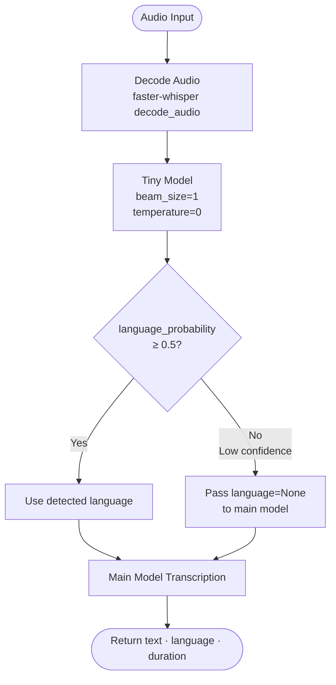

# STT Service

A production-ready, high-performance Speech-to-Text microservice built on [faster-whisper](https://github.com/SYSTRAN/faster-whisper) and served via FastAPI. Designed for low-latency transcription within a containerized, security-hardened environment.

## Table of Contents

- [STT Service](#stt-service)
  - [Table of Contents](#table-of-contents)
  - [Features](#features)
  - [Dual-Model Pipeline](#dual-model-pipeline)
  - [API](#api)
    - [`POST /v1/stt/transcriptions`](#post-v1stttranscriptions)
    - [`GET /health`](#get-health)
    - [`GET /metrics`](#get-metrics)
  - [Configuration](#configuration)
  - [Dependencies](#dependencies)
  - [Repository Structure](#repository-structure)
  - [Docker](#docker)
    - [Build](#build)
    - [Run](#run)
    - [GPU (optional)](#gpu-optional)
    - [Implementation Details](#implementation-details)
  - [Security](#security)
  - [Observability](#observability)

---

## Features

- **4x faster** inference than standard OpenAI Whisper via the CTranslate2 backend
- **~50% lower memory footprint** through INT8 quantization
- **Dual-model pipeline** — a lightweight `tiny` model performs fast language detection before the main model begins transcription
- **Confidence-threshold fallback** — if the `tiny` model's language probability falls below `0.5`, language detection is delegated to the main model, preventing silent misclassification
- **16.5% reduction in total processing time** from offloading language detection to the `tiny` model
- **VAD (Voice Activity Detection)** filtering built into the transcription pipeline to strip silence and reduce hallucinations
- **Prometheus metrics** exposed at `/metrics` for out-of-the-box observability
- **Non-root container execution** for runtime security and container breakout prevention
- **Multi-stage Docker build** that produces a lean, dependency-minimal runtime image

---

## Dual-Model Pipeline

The service separates language detection from transcription across two independently loaded models. This avoids the overhead of running full-beam search on the main model just to determine language.



**Key design decisions:**

| Stage | Model | Config | Purpose |
|---|---|---|---|
| Language Detection | `whisper-tiny` | `beam_size=1`, `temperature=0`, `cpu_threads=2` | Fast, greedy language ID |
| Transcription | Configurable (default: `medium`) | INT8, `vad_filter=True`, `min_silence_ms=500` | High-accuracy transcription |

When the tiny model's confidence is below the threshold, `language=None` is passed to the main model, which performs its own internal language detection during the first transcription pass — adding minimal overhead while guaranteeing correctness.

---

## API

### `POST /v1/stt/transcriptions`

Accepts an audio file URL (e.g. from object storage), downloads it internally, and returns the transcription.

**Request body** (`application/json`):

```json
{
  "audio_url": "https://your-storage/audio/file.wav",
  "context": ""
}
```

| Field | Type | Required | Description |
|---|---|---|---|
| `audio_url` | `string` | Yes | Presigned or accessible URL pointing to the audio file |
| `context` | `string` | No | Optional context hint (reserved for future prompt conditioning) |

**Response** (`200 OK`):

```json
{
  "text": "Hello, how are you today?",
  "language": "en",
  "duration": 1.43
}
```

| Field | Type | Description |
|---|---|---|
| `text` | `string` | Full transcription of the audio |
| `language` | `string` | BCP-47 language code detected or inferred |
| `duration` | `float` | Total server-side processing time in seconds |

**Error responses:**

| Status | Condition |
|---|---|
| `400` | Audio URL returned a non-2xx response (e.g. storage access denied) |
| `502` | Network error reaching the audio URL |
| `500` | Internal transcription failure |

### `GET /health`

Returns `{"status": "ok"}` — used by container orchestrators for liveness probing.

### `GET /metrics`

Prometheus-compatible metrics endpoint exposed by `prometheus-fastapi-instrumentator`. Includes request counts, latencies, and in-flight request gauges per route.

---

## Configuration

All runtime parameters are injected via environment variables with safe defaults.

| Variable | Default | Description |
|---|---|---|
| `WHISPER_MODEL` | `medium` | Main model size: `tiny`, `base`, `small`, `medium`, `large-v3` |
| `WHISPER_MODE` | `cpu` | Inference mode: `cpu` or `gpu` |
| `WHISPER_CPU_THREADS` | `4` | CPU thread count for the main model |
| `WHISPER_NUM_WORKERS` | `2` | Parallel worker count for the main model |

---

## Dependencies

| Package | Version | Role |
|---|---|---|
| `fastapi` | `0.128.7` | API layer — request routing, dependency injection, OpenAPI schema generation |
| `uvicorn` | `0.40.0` | ASGI server — serves FastAPI with async I/O via `asyncio` event loop |
| `python-multipart` | `0.0.22` | Multipart form-data parser required for file upload support in FastAPI |
| `faster-whisper` | `1.2.1` | Core inference engine — CTranslate2-optimized Whisper with INT8 quantization |
| `prometheus-fastapi-instrumentator` | `7.1.0` | Auto-instruments FastAPI routes and exposes a `/metrics` Prometheus endpoint |
| `httpx` | `0.28.1` | Async HTTP client used to fetch audio files from object storage URLs |

---

## Repository Structure

```
stt-service/
├── app/
│   ├── core/             # App config & environment variable bindings
│   ├── models/           # Whisper model loader — singleton init on startup
│   ├── routers/          # API route definitions
│   ├── services/         # Core business logic: STT pipeline & language detection
│   ├── utils/            # Shared helpers
│   └── main.py           # Application entry point
├── .dockerignore
├── Dockerfile            # Multi-stage build
├── requirements.txt
└── README.md
```

---

## Docker

### Host Machine Setup (Required for GPU)

> **macOS users:** NVIDIA CUDA is not supported on Mac (Apple Silicon uses Metal, not CUDA).  
> 
> GPU mode will not work regardless of setup: use `WHISPER_MODE=cpu`.

---

#### Linux + Windows

Install the **NVIDIA Container Toolkit** — this is the bridge that lets Docker talk to your GPU. Without it, `--gpus all` silently does nothing.
```bash
curl -fsSL https://nvidia.github.io/libnvidia-container/gpgkey | sudo gpg --dearmor -o /usr/share/keyrings/nvidia-container-toolkit-keyring.gpg

curl -s -L https://nvidia.github.io/libnvidia-container/stable/deb/nvidia-container-toolkit.list | \
  sed 's#deb https://#deb [signed-by=/usr/share/keyrings/nvidia-container-toolkit-keyring.gpg] https://#g' | \
  sudo tee /etc/apt/sources.list.d/nvidia-container-toolkit.list

sudo apt-get update && sudo apt-get install -y nvidia-container-toolkit

sudo systemctl restart docker
```
> On Windows, Docker Desktop runs containers inside WSL2 (a Linux VM). You install the toolkit *inside that VM*, not on Windows itself. The Windows NVIDIA driver handles the actual GPU communication.

**Prerequisites:**
-  **NVIDIA GPU** ( Pascal architecture or newer with NVIDIA RTX series card recommended )
-  **WSL2** enabled with a **Linux distro** (Ubuntu recommended) 
  to check run in powershell : wsl --list --verbose
-  **[NVIDIA drivers for Windows](https://www.nvidia.com/Download/index.aspx)** installed (the normal desktop driver)
  to check run in powershell : nvidia-smi
-  **[Docker Desktop](https://www.docker.com/products/docker-desktop/)** with the WSL2 backend enabled


**Verify the setup worked :**
```bash
docker run --rm --gpus all nvidia/cuda:12.1.0-base-ubuntu22.04 nvidia-smi
```
You should see your GPU listed. If you get an error, the toolkit isn't wired up correctly.

---

### Build
```bash
docker build -t stt-service:latest .
```

> `WHISPER_MODE` controls both the device (`cpu`/`cuda`) and compute type (`int8`/`float16`) automatically. See [Configuration](#configuration) for details.

The service will be available at `http://stt-service:8000`.

### Docker Compose
```yaml
services:
  stt-service:
    ...
    deploy:
      resources:
        reservations:
          devices:
            - driver: nvidia
              count: 1
              capabilities: [gpu]
```

**What does `deploy.resources.reservations.devices` do?**

It is the Docker Compose equivalent of `--gpus all` on the command line. Without it, Compose starts the container with no GPU access even if the toolkit is installed. Breaking it down:

| Key | Value | Meaning |
|---|---|---|
| `driver` | `nvidia` | Use the NVIDIA runtime (installed by the toolkit) |
| `count` | `1` | Reserve 1 GPU for this container. Use `all` to expose every GPU |
| `capabilities` | `[gpu]` | Grant general GPU compute access (required for CUDA) |

> This block is only meaningful when running with `docker compose` (v2). Plain `docker run` uses `--gpus all` instead.

### Implementation Details

The `Dockerfile` uses a **multi-stage build**:

| Stage | Base Image | Purpose |
|---|---|---|
| `builder` | `python:3.10-slim` | Installs Python dependencies into an isolated virtualenv |
| `runtime` | `nvidia/cuda:12.1.0-cudnn8-runtime-ubuntu22.04` | Ships CUDA + cuDNN runtime libs; copies only the virtualenv and app code |

The `runtime` variant of the NVIDIA image is used (not `devel`) — it contains only the libraries needed to *run* CUDA code, not compile it, keeping the image as lean as possible. cuDNN 8 is required by CTranslate2, the engine underlying faster-whisper.

`ffmpeg` is sourced from a static binary release and installed in the runtime stage to support all audio formats (MP3, OGG, FLAC, M4A, etc.) without pulling in a full `ffmpeg` apt package tree.

> **Note on image size:** the NVIDIA base image adds CUDA + cuDNN, bringing the total image size to ~3–4 GB. This is unavoidable — `runtime` is already the smallest NVIDIA variant that works.

---

## Security

The runtime container enforces a **non-root execution model**:

```dockerfile
RUN groupadd -r appuser && useradd -r -g appuser appuser
...
USER appuser
```

This mitigates container breakout risks: if the process is compromised, the attacker operates as an unprivileged user with no write access outside explicitly chowned directories. The model cache directory (`/model_cache`) is the only path owned by `appuser` and intentionally scoped.

---

## Observability

Prometheus metrics are automatically collected for every route:

```
http_requests_total
http_request_duration_seconds
http_requests_in_progress
```

