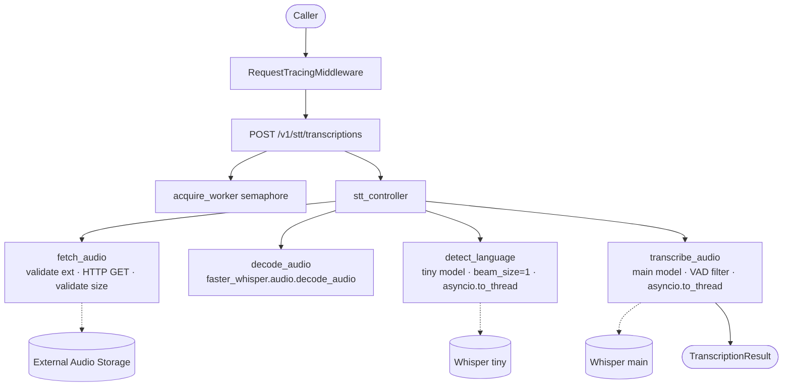
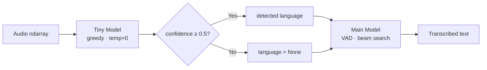
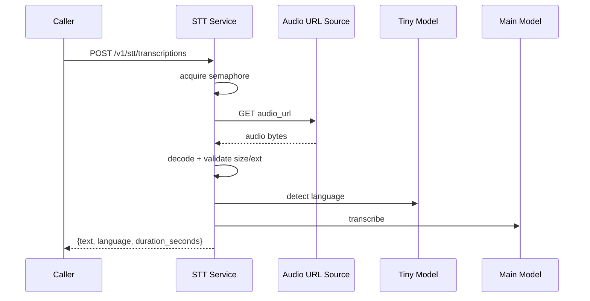

# STT Service


## 1. Basics

| Field | Value |
|-------|-------|
| **Service name** | `stt-service` |
| **Container port** | 8000 (Uvicorn) |
| **Host port** | Not published by default; opt-in via `docker-compose.debug.yml` → `127.0.0.1:${STT_PORT}:8000` |
| **Role** | Speech-to-text microservice. Upstream services (mainly core-api) send audio URLs; the service fetches the audio, detects language, and returns transcription text. |
| **Runtime** | NVIDIA CUDA 12.8 + cuDNN on Ubuntu 24.04 (GPU mode) · Python 3.12 (CPU mode) |
| **Database** | None — this service is stateless beyond model caches |

## 2. Quick Start

### Prerequisites

| Requirement | Why | Install |
|-------------|-----|---------|
| Python 3.12+ | Runtime | [python.org](https://www.python.org/downloads/) or `pyenv` |
| FFmpeg | Audio decoding (used by `av`/faster-whisper) | `apt install ffmpeg` / `brew install ffmpeg` |
| NVIDIA GPU + CUDA drivers (GPU mode) | Model inference acceleration | [CUDA Toolkit 12.8](https://developer.nvidia.com/cuda-toolkit-archive) |
| [NVIDIA Container Toolkit](https://docs.nvidia.com/datacenter/cloud-native/container-toolkit/latest/install-guide.html) | GPU passthrough into Docker containers | Required only for GPU mode in Docker |

### With pip (local)

```bash
cd services/stt/app
pip install -r ../requirements.txt
cp .env.example .env          # then edit .env for your environment
uvicorn main:app --host 0.0.0.0 --port 8000 --reload
```

> **First run note:** The main Whisper model (`large-v3-turbo`, ~1.5 GB) and the `tiny` model (~75 MB) are downloaded from Hugging Face on first startup. This can take several minutes depending on your connection. Set `HF_TOKEN` for higher rate limits.

### With uv (local, preferred for development)

```bash
cd services/stt/app
uv sync                       # install from uv.lock
cp .env.example .env          # then edit .env for your environment
uv run uvicorn main:app --host 0.0.0.0 --port 8000 --reload
```

### With Docker Compose

```bash
# 1. Ensure root .env and services/stt/app/.env exist
cp ../../.env.example ../../.env
cp app/.env.example app/.env

# 2. Start the service (requires COMPOSE_PROFILES=local-upstreams)
docker compose up stt-service
```

**GPU mode** (default) requires the [NVIDIA Container Toolkit](https://docs.nvidia.com/datacenter/cloud-native/container-toolkit/latest/install-guide.html). Docker Compose GPU reservation:

```yaml
deploy:
  resources:
    reservations:
      devices:
        - driver: nvidia
          count: 1
          capabilities: [gpu]
```

**CPU-only mode** — omit `--gpus all` and set `WHISPER_MODE=cpu` in your `.env`:

```bash
# .env
WHISPER_MODE=cpu
```

### Verifying the service is running

```bash
curl http://localhost:8000/health
# {"status":"ok"}
```

To access from the host, use `docker-compose.debug.yml` which binds `127.0.0.1:${STT_PORT}:8000`.

## 3. Service Dependencies & Topology

| Dependency | Purpose | Connection Method | Endpoint / Port |
|---|---|---|---|
| Core API (caller) | Sends transcription requests | HTTP | `POST /v1/stt/transcriptions` |
| Audio source URL (often MinIO presigned URL) | Provides audio bytes to transcribe | Outbound HTTP GET | `request.audio_url` |
| Hugging Face Hub (optional) | Model download / cache warmup | HTTPS | `huggingface.co` |
| Prometheus | Metrics scraping | HTTP pull | `GET /metrics` |
| Promtail / Loki / Grafana | Centralized logs | Docker label + log shipping | `logging=promtail` |

### Service Map



## Why faster-whisper?

The service uses [faster-whisper](https://github.com/SYSTRAN/faster-whisper) instead of the standard OpenAI Whisper library. faster-whisper is a reimplementation of Whisper using the [CTranslate2](https://github.com/OpenNMT/CTranslate2) inference engine, which applies model compression and hardware-level optimisations that make it strictly superior for production workloads.

| Dimension | OpenAI Whisper | faster-whisper (this service) |
|---|---|---|
| **Inference speed** | Baseline | **~4× faster** via CTranslate2 |
| **Memory footprint** | Baseline | **~50% lower** through INT8 quantisation |
| **Compute types** | FP32 / FP16 | FP16 (GPU) · INT8 (CPU) — auto-selected by `WHISPER_MODE` |
| **GPU support** | Yes (PyTorch) | Yes (CUDA via CTranslate2) |
| **CPU support** | Slow | Practical — INT8 quantisation keeps latency acceptable |
| **VAD integration** | Not built-in | Built-in — strips silence, reduces hallucinations |
| **Multi-worker concurrency** | Not supported | Supported — `WHISPER_NUM_WORKERS` semaphore |
| **API compatibility** | Reference API | Drop-in compatible output format |

In short: for the same transcription quality, faster-whisper consumes roughly half the memory and completes in a quarter of the time, which directly translates to higher throughput and lower infrastructure cost.

---

## Dual-Model Pipeline



**Stage 1 — Language detection (tiny model)**

The lightweight `tiny` model runs greedy decoding (`beam_size=1`, `temperature=0`) on the audio to identify the spoken language as cheaply and quickly as possible. Greedy decoding is intentionally lossy here — quality does not matter because only the language tag and its associated confidence score are used; the text output is discarded.

If the returned confidence score is **≥ 0.5**, the detected language tag is passed to the main model, constraining its search space and skipping its own detection pass entirely. If confidence falls **below 0.5**, the language is set to `None` and the main model performs language detection itself during the first transcription pass — preventing silent misclassification on ambiguous or noisy audio.

**Stage 2 — Transcription (main model)**

The configurable main model (default: `large-v3-turbo`) runs beam search over the full audio with VAD (Voice Activity Detection) filtering enabled. VAD pre-processes the waveform to strip non-speech segments (`min_silence_duration_ms=500`) before inference, which reduces both hallucinations on silent passages and the total number of tokens the model has to process. `condition_on_previous_text=False` prevents context drift between segments.

### Why the split pays off

| Metric | Single-model approach | Dual-model approach |
|---|---|---|
| **Language detection cost** | Full main-model pass | Tiny-model greedy pass (negligible) |
| **Total processing time** | Baseline | **~16.5% faster** |
| **Misclassification risk** | Low-confidence results silently accepted | Confidence threshold fallback to main model |
| **Memory overhead** | One model loaded | Tiny model adds minimal VRAM (~70 MB) |
| **Hallucination resistance** | Depends on model | VAD filtering on main model |

The `tiny` model is fast enough that its language detection cost is negligible relative to the main model transcription pass. The net result is a measurable end-to-end speedup without sacrificing accuracy, and an explicit safety net against the silent misclassification failure mode that would occur if a low-confidence language tag were passed through unchecked.

## Data Flow



### Request / Response schemas

**Request** (`TranscriptionRequest`):

```json
{
  "audio_url": "https://storage.example.com/audio/file.mp3",
  "initial_prompt": "Optional context hint for the model"
}
```

| Field | Type | Required | Description |
|-------|------|----------|-------------|
| `audio_url` | `HttpUrl` | Yes | URL to the audio file (presigned MinIO URL, etc.) |
| `initial_prompt` | `string` | No | Optional text passed to the model as context/hint for transcription |

**Response** (`TranscriptionResult`):

```json
{
  "text": "Hello, how are you today?",
  "language": "en",
  "duration_seconds": 1.234
}
```

| Field | Type | Description |
|-------|------|-------------|
| `text` | `string` | The transcribed text |
| `language` | `string \| null` | Detected language code, or `null` if detection fell back to auto |
| `duration_seconds` | `float` | Total wall-clock time for language detection + transcription |

### API endpoints

| Method | Path | Auth | Semaphore | Description |
|--------|------|------|-----------|-------------|
| `POST` | `/v1/stt/transcriptions` | `X-Service-Token` (prod only) | Yes | Main endpoint — accepts audio URL, returns transcription |
| `GET` | `/health` | No | No | Health check — returns `{"status": "ok"}` |
| `GET` | `/metrics` | No | No | Prometheus metrics (auto-exposed by instrumentator) |

## Configuration

All settings are loaded via `pydantic-settings` from environment variables or `.env`. Copy `.env.example` to `.env` and adjust values.

### Primary variables

| Variable | Required | Default | Description |
|----------|----------|---------|-------------|
| `WHISPER_MODE` | No | `gpu` | `cpu` or `gpu` — controls device, compute type, and semaphore sizing |
| `WHISPER_MODEL` | No | `large-v3-turbo` | Main model: `tiny`, `base`, `small`, `medium`, `large-v3-turbo`, `large-v3` |
| `WHISPER_NUM_WORKERS` | No | `2` | Max concurrent transcriptions (GPU mode semaphore size) |
| `WHISPER_CPU_THREADS` | No | `8` (derived) | CPU threads per model; also semaphore size in CPU mode |
| `HF_TOKEN` | No | — | Hugging Face token for model downloads (higher rate limits) |
| `LOG_LEVEL` | No | `INFO` | Python log level (`DEBUG`, `INFO`, `WARNING`, `ERROR`, `CRITICAL`) |

### App / security variables

| Variable | Required | Default | Description |
|----------|----------|---------|-------------|
| `SERVICE_NAME` | No | `stt-service` | Service identifier, used in logs and FastAPI title |
| `IS_PROD` | No | `True` | Production mode flag (used for rate limit multiplier and dev mode startup guard) |
| `EXPLICIT_DEV_MODE` | **Yes** when `IS_PROD=False` | `false` | Must be `"true"` if `IS_PROD=False`, otherwise the service **crashes at startup**. This is a safety guard — not optional. |
| `CORS_ORIGINS` | No | `["*"]` | Allowed CORS origins (JSON-serializable list) |
| `SERVICE_TOKEN` | **Yes** | — | Shared secret for inter-service auth (`X-Service-Token` header). Compared with `secrets.compare_digest` to prevent timing attacks. Always required. |

### Audio constraints

| Variable | Default | Description |
|----------|---------|-------------|
| `MAX_AUDIO_BYTES` | `52428800` (50 MB) | Maximum allowed audio file size in bytes |
| `SUPPORTED_AUDIO_EXTENSIONS` | `.mp3`, `.wav`, `.ogg`, `.flac`, `.m4a` | Allowed audio file extensions (validated from URL path) |

### Derived settings

Set automatically by `WHISPER_MODE` via the `validate_environment` model validator in `core/config.py`. You can override `WHISPER_DEVICE`, `WHISPER_COMPUTE_TYPE`, and `WHISPER_CPU_THREADS` explicitly — empty/zero values fall back to the derived defaults.

| `WHISPER_MODE` | `WHISPER_DEVICE` | `WHISPER_COMPUTE_TYPE` | `WHISPER_CPU_THREADS` | `STT_TIMEOUT_SECONDS` |
|----------------|-----------------|----------------------|----------------------|----------------------|
| `gpu` | `cuda` | `float16` | `0` (unused) | `5` |
| `cpu` | `cpu` | `int8` | `8` | `30` |

### Dockerfile environment variables

These are set in the `Dockerfile` and do not need to be configured in `.env`:

| Variable | Value | Purpose |
|----------|-------|---------|
| `HF_HOME` | `/model_cache` | Hugging Face model cache directory inside the container |
| `PYTHONUNBUFFERED` | `1` | Disables Python stdout buffering for real-time log output |
| `LD_LIBRARY_PATH` | `/usr/local/cuda/lib64:/usr/lib/x86_64-linux-gnu:…/ctranslate2` | CUDA + CTranslate2 shared library search path |

## Dependencies & Integrations

| Dependency / Service | Version | Purpose | Required |
|---------------------|---------|---------|----------|
| `faster-whisper` | 1.2.1 | CTranslate2-optimized Whisper inference engine | Yes |
| `ctranslate2` | 4.7.1 | Backend runtime for faster-whisper (CUDA/CPU) | Yes |
| `fastapi` | 0.128.7 | HTTP API framework with dependency injection | Yes |
| `uvicorn` | 0.40.0 | ASGI server | Yes |
| `httpx` | 0.28.1 | Async HTTP client for fetching audio from URLs | Yes |
| `av` (PyAV) | 16.1.0 | FFmpeg bindings for audio decoding | Yes |
| `pydantic-settings` | 2.13.1 | Typed configuration from env vars / `.env` files | Yes |
| `python-multipart` | 0.0.22 | Multipart form parsing (FastAPI dependency) | Yes |
| `prometheus-fastapi-instrumentator` | 7.1.0 | Auto-instruments routes, exposes `/metrics` | Yes |
| `numpy` | 2.4.2 | Audio array representation | Yes |
| NVIDIA CUDA 12.8 + cuDNN | 12.8.1 | GPU inference runtime | GPU mode only |
| `ffmpeg` (system package) | — | Audio format conversion (used by `av`/`faster-whisper`) | Yes |

> **Note:** `requirements.txt` pins exact versions (used by Docker builds). `pyproject.toml` uses `>=` ranges (used by `uv` for local development). Prefer `uv sync` for local dev and `requirements.txt` for reproducible Docker builds.

## Error Handling

### Domain exceptions

Defined in `exceptions.py`, mapped to HTTP status codes in `stt_router.py`:

| Exception | HTTP Status | Trigger |
|-----------|-------------|---------|
| `UnsupportedAudioFormatError` | **415** | URL has no file extension, or extension not in `SUPPORTED_AUDIO_EXTENSIONS` |
| `AudioTooLargeError` | **413** | Audio exceeds `MAX_AUDIO_BYTES` (50 MB) — checked via `Content-Length` header **and** actual byte count |
| `AudioFetchError` | **502** | HTTP error or network error while fetching audio from URL |
| `AudioDecodeError` | **422** | `faster_whisper.audio.decode_audio` fails (corrupt / unreadable audio) |
| `TranscriptionError` | **500** | Model inference failure |
| Unhandled `Exception` | **500** | Catch-all for unexpected errors |

### Overload protection (503 Service Busy)

- An `asyncio.Semaphore` controls concurrency: size = `WHISPER_NUM_WORKERS` (GPU mode) or `WHISPER_CPU_THREADS` (CPU mode).
- Each request must acquire a semaphore slot before proceeding.
- If acquisition times out after `STT_TIMEOUT_SECONDS` (5 s GPU / 30 s CPU), the service returns **503** with `"STT service busy, please retry"`.
- The semaphore is always released in a `finally` block, even on exceptions.
- **No internal retry/backoff logic** — the service fails fast and delegates retry decisions to the caller. Clients should retry with exponential backoff.

### Slow call warnings

The controller and service functions log warnings when processing exceeds configurable thresholds:

| Component | Threshold | Log level |
|-----------|-----------|-----------|
| Controller (full request) | 5.0 s | `WARNING` |
| Language detection | 2.0 s | `WARNING` |
| Transcription | 5.0 s | `WARNING` |

### Request tracing

Every response includes an `X-Request-ID` header (propagated from the incoming `X-Request-ID` header, or auto-generated as UUID4). All log lines for that request share the same ID for cross-service correlation. Logging is single-line JSON to stdout with fields: `timestamp`, `level`, `service`, `module`, `request_id`, `message`, plus optional HTTP fields (`http_method`, `http_path`, `client_ip`, `status_code`, `duration_s`).

### Logging exclusions

`/metrics`, `/health`, and `/favicon.ico` are excluded from request logging to reduce noise.

### Dev mode safety

When `IS_PROD=False`, the `EXPLICIT_DEV_MODE` guard requires explicit `"true"` confirmation or the service crashes at startup. In dev mode:

- A prominent `WARNING: DEV MODE IS ACTIVE` banner is logged at startup.
- **Never set `IS_PROD=False` in production.**

## Directory Structure

```
services/stt/
├── .dockerignore
├── Dockerfile                  # CUDA 12.8 base, pip install from requirements.txt
├── README.md
├── requirements.txt            # pinned deps (Docker builds)
└── app/
    ├── .env.example            # template — copy to .env
    ├── .python-version         # 3.12
    ├── pyproject.toml          # >= ranges (uv dev)
    ├── uv.lock                 # uv lockfile
    ├── main.py                 # FastAPI app factory + lifespan (model loading, semaphore init)
    ├── exceptions.py           # domain exception hierarchy
    ├── core/
    │   ├── config.py           # pydantic-settings: all env vars + derived defaults
    │   └── logging_setup.py    # JSON formatter + RequestTracingMiddleware
    ├── routers/
    │   └── stt_router.py       # POST /v1/stt/transcriptions
    ├── controllers/
    │   └── stt_controller.py   # pipeline orchestrator (fetch → decode → detect → transcribe)
    ├── services/
    │   ├── transcribe.py       # main model transcription (async, thread-offloaded)
    │   └── detect_lang.py      # tiny model language detection (async, thread-offloaded)
    ├── models/
    │   └── whisper.py          # WhisperModel registry + lifecycle (load at startup)
    ├── schemas/
    │   └── stt_schemas.py      # Pydantic request/response models
    └── utils/
        ├── acquire_worker.py   # semaphore dependency for concurrency control
        ├── auth.py             # X-Service-Token verification (secrets.compare_digest)
        ├── get_client.py       # FastAPI Depends — httpx.AsyncClient
        ├── get_model.py        # FastAPI Depends — (main_model, tiny_model) tuple
        ├── logger.py           # module-level logger shortcut
        └── process_audio.py    # fetch, validate, decode audio
```

> **No `__init__.py` files** — all packages use Python 3.12 implicit namespace packages.
> **No database** — no ORM, no Alembic, no `crud/`, no `dependencies/`, no `middlewares/` directories.
