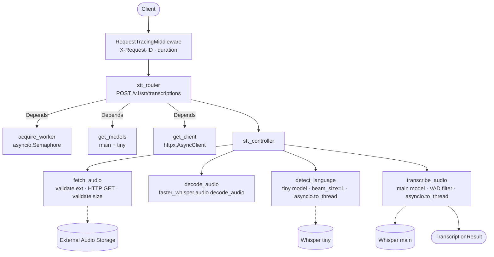
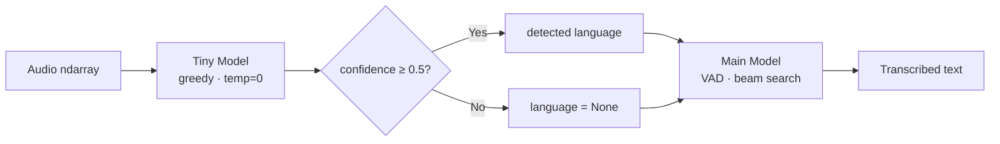
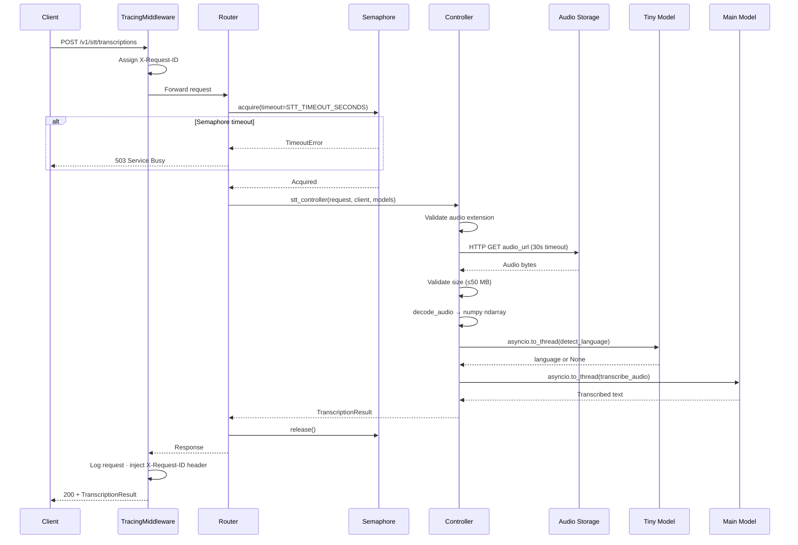

# STT Service

## Overview

A FastAPI microservice that transcribes audio files via [faster-whisper](https://github.com/SYSTRAN/faster-whisper) (CTranslate2 backend). Accepts a URL pointing to an audio file, downloads it, runs a dual-model pipeline (tiny model for language detection, configurable main model for transcription), and returns the text with detected language and processing duration. Designed to run GPU-accelerated inside Docker with semaphore-based concurrency control.

## Architecture



## Why faster-whisper?

The service uses [faster-whisper](https://github.com/SYSTRAN/faster-whisper) instead of the standard OpenAI Whisper library. faster-whisper is a reimplementation of Whisper using the [CTranslate2](https://github.com/OpenNMT/CTranslate2) inference engine, which applies model compression and hardware-level optimisations that make it strictly superior for production workloads.

| Dimension | OpenAI Whisper | faster-whisper (this service) |
|---|---|---|
| **Inference speed** | Baseline | **~4× faster** via CTranslate2 |
| **Memory footprint** | Baseline | **~50% lower** through INT8 quantisation |
| **Compute types** | FP32 / FP16 | FP16 (GPU) · INT8 (CPU) — auto-selected by `WHISPER_MODE` |
| **GPU support** | Yes (PyTorch) | Yes (CUDA via CTranslate2) |
| **CPU support** | Slow | Practical — INT8 quantisation keeps latency acceptable |
| **VAD integration** | Not built-in | Built-in — strips silence, reduces hallucinations |
| **Multi-worker concurrency** | Not supported | Supported — `WHISPER_NUM_WORKERS` semaphore |
| **API compatibility** | Reference API | Drop-in compatible output format |

In short: for the same transcription quality, faster-whisper consumes roughly half the memory and completes in a quarter of the time, which directly translates to higher throughput and lower infrastructure cost.

---

## Dual-Model Pipeline



**Stage 1 — Language detection (tiny model)**

The lightweight `tiny` model runs greedy decoding (`beam_size=1`, `temperature=0`) on the audio to identify the spoken language as cheaply and quickly as possible. Greedy decoding is intentionally lossy here — quality does not matter because only the language tag and its associated confidence score are used; the text output is discarded.

If the returned confidence score is **≥ 0.5**, the detected language tag is passed to the main model, constraining its search space and skipping its own detection pass entirely. If confidence falls **below 0.5**, the language is set to `None` and the main model performs language detection itself during the first transcription pass — preventing silent misclassification on ambiguous or noisy audio.

**Stage 2 — Transcription (main model)**

The configurable main model (default: `large-v3-turbo`) runs beam search over the full audio with VAD (Voice Activity Detection) filtering enabled. VAD pre-processes the waveform to strip non-speech segments before inference, which reduces both hallucinations on silent passages and the total number of tokens the model has to process.

### Why the split pays off

| Metric | Single-model approach | Dual-model approach |
|---|---|---|
| **Language detection cost** | Full main-model pass | Tiny-model greedy pass (negligible) |
| **Total processing time** | Baseline | **~16.5% faster** |
| **Misclassification risk** | Low-confidence results silently accepted | Confidence threshold fallback to main model |
| **Memory overhead** | One model loaded | Tiny model adds minimal VRAM (~70 MB) |
| **Hallucination resistance** | Depends on model | VAD filtering on main model |

The `tiny` model is fast enough that its language detection cost is negligible relative to the main model transcription pass. The net result is a measurable end-to-end speedup without sacrificing accuracy, and an explicit safety net against the silent misclassification failure mode that would occur if a low-confidence language tag were passed through unchecked.


## API Reference

### Speech-to-Text

| Method | Endpoint | Request Body | Response | Description |
|--------|----------|-------------|----------|-------------|
| `POST` | `/v1/stt/transcriptions` | `TranscriptionRequest` (JSON) | `TranscriptionResult` (JSON) | Fetch audio from URL, detect language, transcribe |

**`TranscriptionRequest`**

| Field | Type | Required | Description |
|-------|------|----------|-------------|
| `audio_url` | `HttpUrl` | Yes | Accessible URL pointing to the audio file |
| `initial_prompt` | `string` | No | Context text passed to the model to condition transcription |

**`TranscriptionResult`**

| Field | Type | Description |
|-------|------|-------------|
| `text` | `string` | Full transcription |
| `language` | `string \| null` | BCP-47 language code, or `null` if detection was uncertain |
| `duration_seconds` | `float` | Wall-clock time for language detection + transcription |

### Infrastructure

| Method | Endpoint | Response | Description |
|--------|----------|----------|-------------|
| `GET` | `/health` | `{"status": "ok"}` | Liveness probe |
| `GET` | `/metrics` | Prometheus text | Auto-instrumented request metrics (counts, latencies, in-flight gauges) |

## Data Flow



## Configuration

All settings are loaded via `pydantic-settings` from environment variables or `.env`.

| Variable | Required | Default | Description |
|----------|----------|---------|-------------|
| `WHISPER_MODE` | No | `gpu` | `cpu` or `gpu` — controls device, compute type, and semaphore sizing |
| `WHISPER_MODEL` | No | `large-v3-turbo` | Main model: `tiny`, `base`, `small`, `medium`, `large-v3-turbo`, `large-v3` |
| `WHISPER_NUM_WORKERS` | No | `2` | Max concurrent transcriptions (GPU mode semaphore size) |
| `WHISPER_CPU_THREADS` | No | `8` (derived) | CPU threads per model; also semaphore size in CPU mode |
| `HF_TOKEN` | No | — | Hugging Face token for model downloads (higher rate limits) |
| `LOG_LEVEL` | No | `INFO` | Python log level |

**Derived settings** (set automatically by `WHISPER_MODE`, overridable):

| `WHISPER_MODE` | `WHISPER_DEVICE` | `WHISPER_COMPUTE_TYPE` | `WHISPER_CPU_THREADS` |
|----------------|-----------------|----------------------|----------------------|
| `gpu` | `cuda` | `float16` | `0` (unused) |
| `cpu` | `cpu` | `int8` | `8` |

**Constraints**: `MAX_AUDIO_BYTES` = 50 MB, `SUPPORTED_AUDIO_EXTENSIONS` = `.mp3`, `.wav`, `.ogg`, `.flac`, `.m4a`.


## Docker

```bash
docker compose build stt-service
```

GPU requires the [NVIDIA Container Toolkit](https://docs.nvidia.com/datacenter/cloud-native/container-toolkit/latest/install-guide.html). For CPU-only, omit `--gpus all` and set `WHISPER_MODE=cpu`.

Docker Compose GPU reservation:
```yaml
deploy:
  resources:
    reservations:
      devices:
        - driver: nvidia
          count: 1
          capabilities: [gpu]
```

## Dependencies & Integrations

| Dependency / Service | Purpose | Required |
|---------------------|---------|----------|
| `faster-whisper` 1.2.1 | CTranslate2-optimized Whisper inference engine | Yes |
| `ctranslate2` 4.7.1 | Backend runtime for faster-whisper (CUDA/CPU) | Yes |
| `fastapi` 0.128.7 | HTTP API framework with dependency injection | Yes |
| `uvicorn` 0.40.0 | ASGI server | Yes |
| `httpx` 0.28.1 | Async HTTP client for fetching audio from URLs | Yes |
| `av` (PyAV) 16.1.0 | FFmpeg bindings for audio decoding | Yes |
| `pydantic-settings` 2.13.1 | Typed configuration from env vars / `.env` files | Yes |
| `python-multipart` 0.0.22 | Multipart form parsing (FastAPI dependency) | Yes |
| `prometheus-fastapi-instrumentator` 7.1.0 | Auto-instruments routes, exposes `/metrics` | Yes |
| `numpy` 2.4.2 | Audio array representation | Yes |
| NVIDIA CUDA 12.8 + cuDNN | GPU inference runtime | Only for GPU mode |
| `ffmpeg` (system) | Audio format conversion (used by `av`/`faster-whisper`) | Yes |

## Error Handling

- **Domain exceptions** in `exceptions.py` map to specific HTTP status codes at the router layer:

| Exception | HTTP Status | Detail |
|-----------|-------------|--------|
| `UnsupportedAudioFormatError` | 415 | Unsupported audio format |
| `AudioTooLargeError` | 413 | Audio exceeds 50 MB limit |
| `AudioFetchError` | 502 | Failed to fetch audio from URL (network error or non-2xx upstream) |
| `AudioDecodeError` | 422 | Audio bytes could not be decoded |
| `TranscriptionError` | 500 | Model inference failure |
| Unhandled exception | 500 | Unexpected internal error |

- **503 Service Busy**: returned by the `acquire_worker` semaphore dependency when all workers are occupied and the timeout (`STT_TIMEOUT_SECONDS`, default 5s GPU / 30s CPU) expires. Clients should retry with backoff.
- **Request tracing**: every response includes an `X-Request-ID` header (propagated from the incoming header or generated as UUID4). All log lines for that request share the same ID for cross-service correlation.
- **No retry/backoff logic** is implemented internally — the service fails fast and delegates retry decisions to the caller.
- **Logging exclusions**: `/metrics`, `/health`, and `/favicon.ico` are excluded from request logging to reduce noise.
